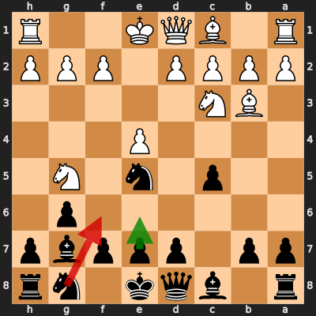
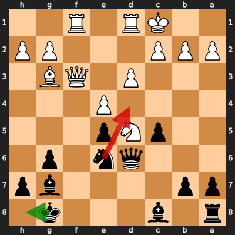

# Analysis: cyyypp vs erivera90

**Date:** 2026.03.27 | **Event:** Live Chess | **Site:** Chess.com

## Rolling CLAMP (last 20 games)
_Window: **1** game(s) on file, **1** blunder(s). Tags recorded on **1** blunder(s). (One blunder can have multiple CLAMP tags.)_

| Letter | Category | Count | Share of tag hits |
|--------|----------|-------|-------------------|
| **C** | Checks | 1 | 33% |
| **L** | Loose pieces / squares | 1 | 33% |
| **A** | Alignments (forks, pins, lines) | 0 | 0% |
| **M** | Mobility / trapped piece | 0 | 0% |
| **P** | Passed pawns | 1 | 33% |

Found **2** crucial moments.

## Moment 1 — Blunder [MAJOR]

**Tactic:** Positional

**FEN:** `r1bqk1nr/pp1pppbp/6p1/2p1n1N1/4P3/1BN5/PPPP1PPP/R1BQK2R b KQkq - 5 6`

- **You Played:** **Nf6** (Red Arrow)
- **Engine Best:** **e6** (Green Arrow)
- **Eval Swing:** -307 cp
- **Variation:** _e6 d3_

**Refutation:** _f4 Nc6 Nxf7 Qa5 Nxh8 d5_

---
## Moment 2 — Blunder [CRITICAL]

**Tactic:** Back-Rank Mate

- **CLAMP:** C · A · P
  - **C** (Checks): Opponent's best line includes a damaging check or forced mate.
  - **A** (Alignments (forks, pins, lines)): Tactical alignment: fork, pin, skewer, discovered attack, or mating line.
  - **P** (Passed pawns): Opponent's play creates or exploits a dangerous passed pawn.

**FEN:** `r1b3k1/pp4bp/3qn1p1/2pNp3/4P3/3P1QB1/PPP3PP/2KR1R2 b - - 1 18`

- **You Played:** **Nd4** (Red Arrow)
- **Engine Best:** **Kh8** (Green Arrow)
- **Eval Swing:** -9596 cp
- **Variation:** _Kh8 Qf7 Bd7 Kb1 Rd8 Qe7_

**Refutation:** _Qf7+ Kh8 Qe8+ Bf8 Bxe5+ Kg8_

---
