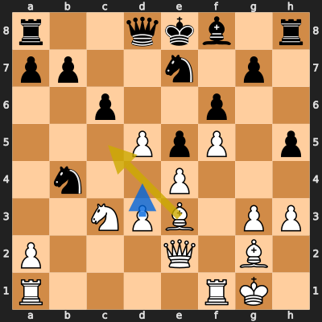
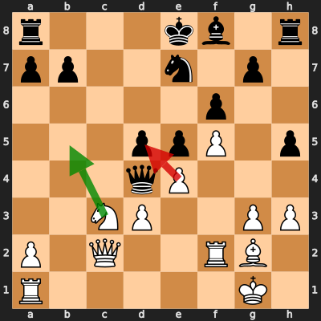

# Analysis: erivera90 vs Riju_j

**Date:** 2026.03.27 | **Event:** Live Chess | **Site:** Chess.com

## Rolling CLAMP (last 20 games)
_Window: **2** game(s) on file, **3** blunder(s). Tags recorded on **2** blunder(s). (One blunder can have multiple CLAMP tags.)_

| Letter | Category | Count | Share of tag hits |
|--------|----------|-------|-------------------|
| **C** | Checks | 2 | 33% |
| **L** | Loose pieces / squares | 1 | 17% |
| **A** | Alignments (forks, pins, lines) | 1 | 17% |
| **M** | Mobility / trapped piece | 0 | 0% |
| **P** | Passed pawns | 2 | 33% |

Found **2** crucial moments (1 blunder, 1 missed opportunity).

## Moment 1 — Missed Opportunity [MAJOR]

**Tactic:** Missed Positional

**FEN:** `r2qkb1r/pp2n1p1/2p2p2/3PpP1p/1n2P3/2NPB1PP/P3Q1B1/R4RK1 w kq - 0 17`

- **You Played:** **Bc5**
- **You Could Have Played:** **d4**
- **Eval Swing:** -433 cp
- **Best Line:** _d4 cxd5 exd5 Rc8 Rac1 Rxc3_

---
## Moment 2 — Blunder [MAJOR]

**Tactic:** Trapped Piece

- **CLAMP:** M
  - **M** (Mobility / trapped piece): A piece lost mobility and could not escape safely.

**FEN:** `r3kb1r/pp2n1p1/5p2/3ppP1p/3qP3/2NP2PP/P1Q2RB1/R5K1 w kq - 0 21`

- **You Played:** **exd5** (Red Arrow)
- **Engine Best:** **Nb5** (Green Arrow)
- **Eval Swing:** -360 cp
- **Variation:** _Nb5 Qe3 Rb1 Kf7 Nd6+ Kg8_

> **CRITICAL: Your move allowed the opponent to immediately capture your White Pawn on f5.**

**Refutation:** _Nxf5_

---
