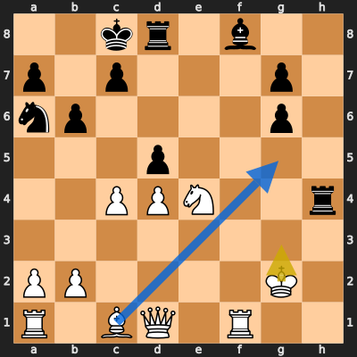
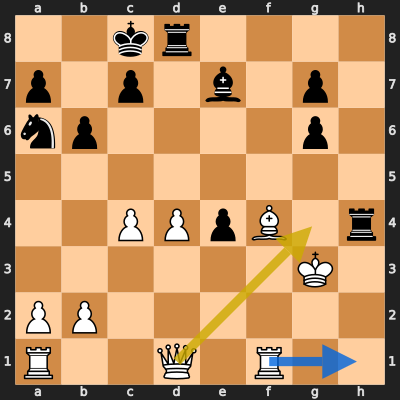
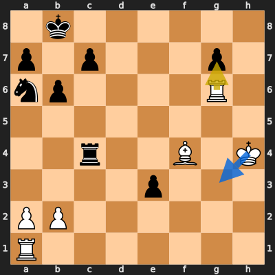
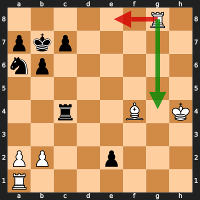

# Analysis: erivera90 vs eduardogms

**Date:** 2026.03.27 | **Event:** Live Chess | **Site:** Chess.com

## Rolling CLAMP (last 20 games)
_Window: **0** game(s) on file, **0** blunder(s). Tags recorded on **0** blunder(s). (One blunder can have multiple CLAMP tags.)_

_No blunders in the rolling window yet — run more analyses to populate this._
Found **4** crucial moments (1 blunder, 3 missed opportunitys).

## Moment 1 — Missed Opportunity [MINOR]

**Tactic:** Missed Fork

**FEN:** `2kr1b2/p1p3p1/np4p1/3p4/2PPN2r/8/PP4K1/R1BQ1R2 w - - 0 21`

- **You Played:** **Kg3**
- **You Could Have Played:** **Bg5**
- **Eval Swing:** -262 cp
- **Best Line:** _Bg5 Rxe4 Bxd8 Bb4 Bg5 Re8_

---
## Moment 2 — Missed Opportunity [MAJOR]

**Tactic:** Missed Positional

**FEN:** `2kr4/p1p1b1p1/np4p1/8/2PPpB1r/6K1/PP6/R2Q1R2 w - - 0 23`

- **You Played:** **Qg4+**
- **You Could Have Played:** **Rh1**
- **Eval Swing:** -471 cp
- **Best Line:** _Rh1 Rxf4 Kxf4 Kb7 Kxe4 Bf6_

---
## Moment 3 — Missed Opportunity [MAJOR]

**Tactic:** Missed Pin

**FEN:** `1k6/p1p3p1/np4R1/8/2r2B1K/4p3/PP6/R7 w - - 0 28`

- **You Played:** **Rxg7**
- **You Could Have Played:** **Kg3**
- **Eval Swing:** -398 cp
- **Best Line:** _Kg3 Nb4 Re6 Kc8 Bxe3 Kd7_

---
## Moment 4 — Blunder [CRITICAL]

**Tactic:** Hanging Piece

- **CLAMP:** C · L · P
  - **C** (Checks): Opponent's best line includes a damaging check or forced mate.
  - **L** (Loose pieces / squares): Material was loose, hanging, or lost in an unfavorable exchange.
  - **P** (Passed pawns): Opponent's play creates or exploits a dangerous passed pawn.

**FEN:** `6R1/pkp5/np6/8/2r2B1K/8/PP2p3/R7 w - - 2 30`

- **You Played:** **Re8** (Red Arrow)
- **Engine Best:** **Rg4** (Green Arrow)
- **Eval Swing:** -778 cp
- **Variation:** _Rg4 Rc2 Be5 Nc5 Bc3 a5_

> **CRITICAL: Your move allowed the opponent to immediately capture your White Bishop on f4.**

**Refutation:** _Rxf4+ Kg5 Rf1 Rxe2 Rxa1 a3_

---
