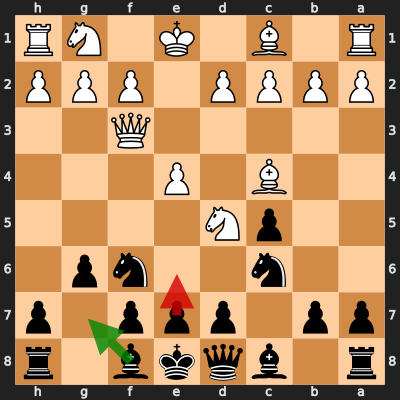

# Analysis: Canada125 vs erivera90

**Date:** 2026.03.28 | **Event:** Live Chess | **Site:** Chess.com

## Rolling CLAMP (last 20 games)
_Window: **3** game(s) on file, **4** blunder(s). Tags recorded on **3** blunder(s). (One blunder can have multiple CLAMP tags.)_

| Letter | Category | Count | Share of tag hits |
|--------|----------|-------|-------------------|
| **C** | Checks | 2 | 29% |
| **L** | Loose pieces / squares | 1 | 14% |
| **A** | Alignments (forks, pins, lines) | 1 | 14% |
| **M** | Mobility / trapped piece | 1 | 14% |
| **P** | Passed pawns | 2 | 29% |

Found **1** crucial moments.

## Moment 1 — Blunder [MAJOR]

**Tactic:** Discovered Attack

- **CLAMP:** C · A
  - **C** (Checks): Opponent's best line includes a damaging check or forced mate.
  - **A** (Alignments (forks, pins, lines)): Tactical alignment: fork, pin, skewer, discovered attack, or mating line.

**FEN:** `r1bqkb1r/pp1ppp1p/2n2np1/2pN4/2B1P3/5Q2/PPPP1PPP/R1B1K1NR b KQkq - 1 5`

- **You Played:** **e6** (Red Arrow)
- **Engine Best:** **Bg7** (Green Arrow)
- **Eval Swing:** -426 cp
- **Variation:** _Bg7_

> **CRITICAL: Your move allowed the opponent to immediately capture your Black Knight on f6.**

**Refutation:** _Nxf6+ Ke7 Ng4 Ke8 e5 Bg7_

---
