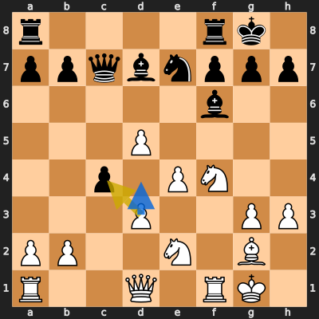
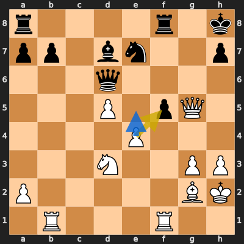
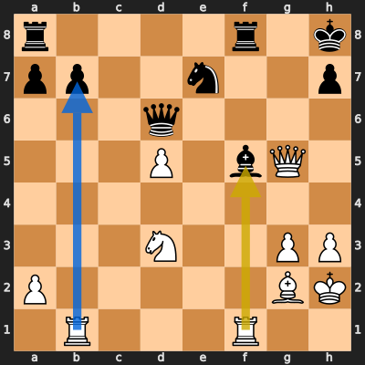
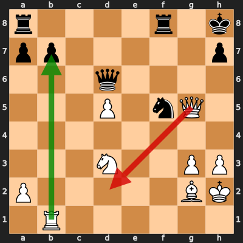
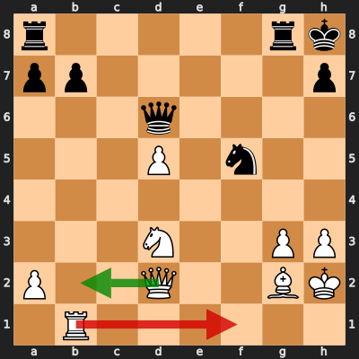

# Analysis: erivera90 vs Binkzki

**Date:** 2026.03.28 | **Event:** Live Chess | **Site:** Chess.com

## Rolling CLAMP (last 20 games)
_Window: **4** game(s) on file, **5** blunder(s). Tags recorded on **4** blunder(s). (One blunder can have multiple CLAMP tags.)_

| Letter | Category | Count | Share of tag hits |
|--------|----------|-------|-------------------|
| **C** | Checks | 3 | 33% |
| **L** | Loose pieces / squares | 1 | 11% |
| **A** | Alignments (forks, pins, lines) | 2 | 22% |
| **M** | Mobility / trapped piece | 1 | 11% |
| **P** | Passed pawns | 2 | 22% |

Found **5** crucial moments (2 blunders, 3 missed opportunitys).

## Moment 1 — Missed Opportunity [MINOR]

**Tactic:** Missed Positional

**FEN:** `r4rk1/ppqbnppp/5b2/3P4/2p1PN2/3P2PP/PP2N1B1/R2Q1RK1 w - - 0 17`

- **You Played:** **dxc4**
- **You Could Have Played:** **d4**
- **Eval Swing:** -226 cp
- **Best Line:** _d4 Bg5 Kh2 Rae8 Qc2 b5_

---
## Moment 2 — Missed Opportunity [MINOR]

**Tactic:** Missed Pin

**FEN:** `r4r1k/pp1bn2p/3q4/3P1pQ1/4P3/3N2PP/P5BK/1R3R2 w - - 1 26`

- **You Played:** **exf5**
- **You Could Have Played:** **e5**
- **Eval Swing:** -201 cp
- **Best Line:** _e5 Qa6 Nf4 Rf7 e6 Rg7_

---
## Moment 3 — Missed Opportunity [MAJOR]

**Tactic:** Missed Skewer

**FEN:** `r4r1k/pp2n2p/3q4/3P1bQ1/8/3N2PP/P5BK/1R3R2 w - - 0 27`

- **You Played:** **Rxf5**
- **You Could Have Played:** **Rxb7**
- **Eval Swing:** -437 cp
- **Best Line:** _Rxb7 Rae8 Rxa7 Qg6 Qxg6 Nxg6_

---
## Moment 4 — Blunder [MINOR]

**Tactic:** Fork

- **CLAMP:** C · A
  - **C** (Checks): Opponent's best line includes a damaging check or forced mate.
  - **A** (Alignments (forks, pins, lines)): Tactical alignment: fork, pin, skewer, discovered attack, or mating line.

**FEN:** `r4r1k/pp5p/3q4/3P1nQ1/8/3N2PP/P5BK/1R6 w - - 0 28`

- **You Played:** **Qd2** (Red Arrow)
- **Engine Best:** **Rxb7** (Green Arrow)
- **Eval Swing:** -255 cp
- **Variation:** _Rxb7 Rae8_

> **CRITICAL: Your move allowed the opponent to immediately capture your White Pawn on g3.**

**Refutation:** _Qxg3+ Kh1 Ng7 Rg1 b6 Qc3_

---
## Moment 5 — Blunder [MAJOR]

**Tactic:** Fork

- **CLAMP:** C · A
  - **C** (Checks): Opponent's best line includes a damaging check or forced mate.
  - **A** (Alignments (forks, pins, lines)): Tactical alignment: fork, pin, skewer, discovered attack, or mating line.

**FEN:** `r5rk/pp5p/3q4/3P1n2/8/3N2PP/P2Q2BK/1R6 w - - 2 29`

- **You Played:** **Rf1** (Red Arrow)
- **Engine Best:** **Qb2+** (Green Arrow)
- **Eval Swing:** -400 cp
- **Variation:** _Qb2+ Rg7 Nf4 Kg8 Nh5 Re7_

> **CRITICAL: Your move allowed the opponent to immediately capture your White Pawn on g3.**

**Refutation:** _Qxg3+ Kh1 Qxg2+ Qxg2 Rxg2 Rxf5_

---
