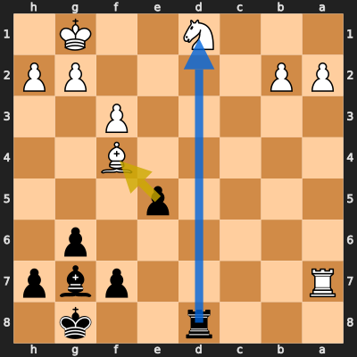
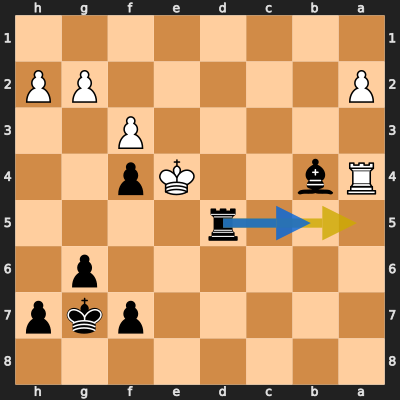
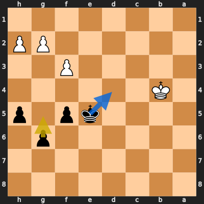
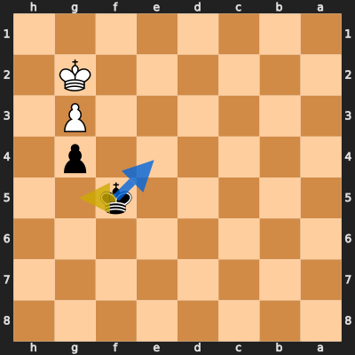

# Analysis: MOHAMEDSALEH19820 vs erivera90

**Date:** 2026.03.29 | **Event:** Live Chess | **Site:** Chess.com

## Rolling CLAMP (last 20 games)
_Window: **7** game(s) on file, **9** blunder(s). Tags recorded on **8** blunder(s). (One blunder can have multiple CLAMP tags.)_

| Letter | Category | Count | Share of tag hits |
|--------|----------|-------|-------------------|
| **C** | Checks | 6 | 38% |
| **L** | Loose pieces / squares | 1 | 6% |
| **A** | Alignments (forks, pins, lines) | 6 | 38% |
| **M** | Mobility / trapped piece | 1 | 6% |
| **P** | Passed pawns | 2 | 12% |

Found **4** crucial moments (0 blunders, 4 missed opportunitys).

## Moment 1 — Missed Opportunity [MAJOR]

**Tactic:** Missed Hanging Piece

**FEN:** `3r2k1/R4pbp/6p1/4p3/5B2/5P2/PP4PP/3N2K1 b - - 0 22`

- **You Played:** **exf4**
- **You Could Have Played:** **Rxd1+**
- **Eval Swing:** -321 cp
- **Best Line:** _Rxd1+ Kf2 exf4 Ra8+ Bf8 Ke2_

---
## Moment 2 — Missed Opportunity [MAJOR]

**Tactic:** Missed Positional

**FEN:** `8/5pkp/6p1/3r4/Rb2Kp2/5P2/P5PP/8 b - - 3 31`

- **You Played:** **Ra5**
- **You Could Have Played:** **Rb5**
- **Eval Swing:** -440 cp
- **Best Line:** _Rb5 Kd3 Rb8 Kc2 g5 h3_

---
## Moment 3 — Missed Opportunity [CRITICAL]

**Tactic:** Missed Positional

**FEN:** `8/8/6p1/4kp1p/1K6/5P2/6PP/8 b - - 1 41`

- **You Played:** **g5**
- **You Could Have Played:** **Kd4**
- **Eval Swing:** -507 cp
- **Best Line:** _Kd4 g3 Ke3 Ka3 Kxf3 Kb2_

---
## Moment 4 — Missed Opportunity [CRITICAL]

**Tactic:** Missed Positional

**FEN:** `8/8/8/5k2/6p1/6P1/6K1/8 b - - 2 49`

- **You Played:** **Kg5**
- **You Could Have Played:** **Ke4**
- **Eval Swing:** -541 cp
- **Best Line:** _Ke4 Kf2 Kd3 Kg1 Ke3 Kf1_

---
