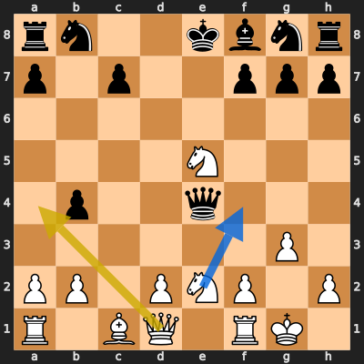
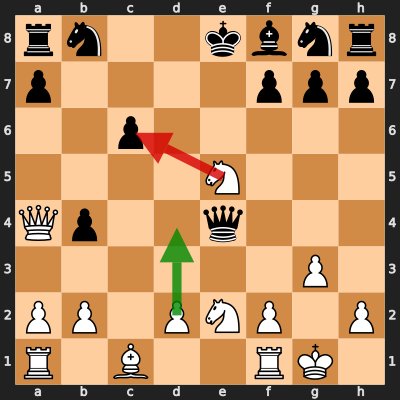

# Analysis: erivera90 vs ashish_raj_AA

**Date:** 2026.03.29 | **Event:** Live Chess | **Site:** Chess.com

## Rolling CLAMP (last 20 games)
_Window: **5** game(s) on file, **7** blunder(s). Tags recorded on **6** blunder(s). (One blunder can have multiple CLAMP tags.)_

| Letter | Category | Count | Share of tag hits |
|--------|----------|-------|-------------------|
| **C** | Checks | 5 | 38% |
| **L** | Loose pieces / squares | 1 | 8% |
| **A** | Alignments (forks, pins, lines) | 4 | 31% |
| **M** | Mobility / trapped piece | 1 | 8% |
| **P** | Passed pawns | 2 | 15% |

Found **2** crucial moments (1 blunder, 1 missed opportunity).

## Moment 1 — Missed Opportunity [MINOR]

**Tactic:** Missed Positional

**FEN:** `rn2kbnr/p1p2ppp/8/4N3/1p2q3/6P1/PP1PNP1P/R1BQ1RK1 w kq - 0 14`

- **You Played:** **Qa4+**
- **You Could Have Played:** **Nf4**
- **Eval Swing:** -233 cp
- **Best Line:** _Nf4 Qxe5 Re1 Qxe1+ Qxe1+ Kd7_

---
## Moment 2 — Blunder [MAJOR]

**Tactic:** Fork

- **CLAMP:** A
  - **A** (Alignments (forks, pins, lines)): Tactical alignment: fork, pin, skewer, discovered attack, or mating line.

**FEN:** `rn2kbnr/p4ppp/2p5/4N3/Qp2q3/6P1/PP1PNP1P/R1B2RK1 w kq - 0 15`

- **You Played:** **Nxc6** (Red Arrow)
- **Engine Best:** **d4** (Green Arrow)
- **Eval Swing:** -468 cp
- **Variation:** _d4 f6 Nf4 fxe5 Ne6 Ne7_

> **CRITICAL: Your move allowed the opponent to immediately capture your White Knight on c6.**

**Refutation:** _Qxc6_

---
