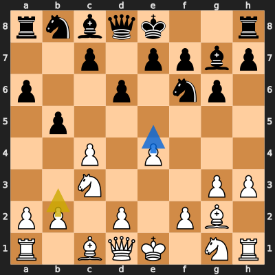
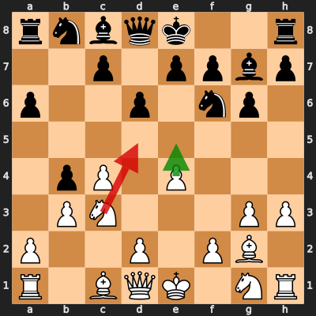
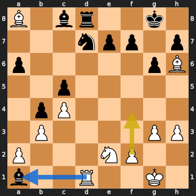

# Analysis: erivera90 vs bugutu24

**Date:** 2026.03.29 | **Event:** Live Chess | **Site:** Chess.com

## Rolling CLAMP (last 20 games)
_Window: **8** game(s) on file, **9** blunder(s). Tags recorded on **8** blunder(s). (One blunder can have multiple CLAMP tags.)_

| Letter | Category | Count | Share of tag hits |
|--------|----------|-------|-------------------|
| **C** | Checks | 6 | 38% |
| **L** | Loose pieces / squares | 1 | 6% |
| **A** | Alignments (forks, pins, lines) | 6 | 38% |
| **M** | Mobility / trapped piece | 1 | 6% |
| **P** | Passed pawns | 2 | 12% |

Found **3** crucial moments (1 blunder, 2 missed opportunitys).

## Moment 1 — Missed Opportunity [MAJOR]

**Tactic:** Missed Discovered Attack

**FEN:** `rnbqk2r/2p1ppbp/p2p1np1/1p6/2P1P3/2N3PP/PP1P1PB1/R1BQK1NR w KQkq - 0 7`

- **You Played:** **b3**
- **You Could Have Played:** **e5**
- **Eval Swing:** -309 cp
- **Best Line:** _e5 dxe5 Bxa8 c6 d3 b4_

---
## Moment 2 — Blunder [MAJOR]

**Tactic:** Discovered Attack

- **CLAMP:** A
  - **A** (Alignments (forks, pins, lines)): Tactical alignment: fork, pin, skewer, discovered attack, or mating line.

**FEN:** `rnbqk2r/2p1ppbp/p2p1np1/8/1pP1P3/1PN3PP/P2P1PB1/R1BQK1NR w KQkq - 0 8`

- **You Played:** **Nd5** (Red Arrow)
- **Engine Best:** **e5** (Green Arrow)
- **Eval Swing:** -407 cp
- **Variation:** _e5 Ra7_

> **CRITICAL: Your move allowed the opponent to immediately capture your White Knight on d5.**

**Refutation:** _Nxd5 exd5 Bxa1 d4 Bc3+ Kf1_

---
## Moment 3 — Missed Opportunity [MAJOR]

**Tactic:** Missed Hanging Piece

**FEN:** `B1br2k1/3npp1p/p5pB/2p5/1pP5/1P4PP/P3NP2/b2R2K1 w - - 3 18`

- **You Played:** **f4**
- **You Could Have Played:** **Rxa1**
- **Eval Swing:** -442 cp
- **Best Line:** _Rxa1 Ne5 Bg2 Nxc4 bxc4 Be6_

---
