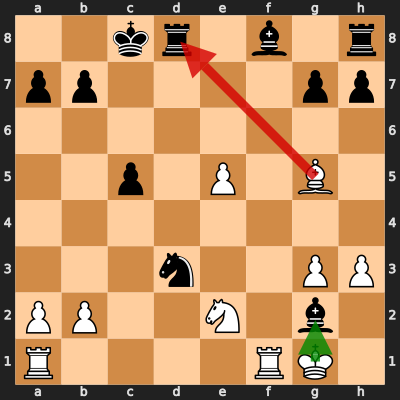

# Analysis: erivera90 vs thegrenth

**Date:** 2026.03.29 | **Event:** Live Chess | **Site:** Chess.com

## Rolling CLAMP (last 20 games)
_Window: **9** game(s) on file, **10** blunder(s). Tags recorded on **9** blunder(s). (One blunder can have multiple CLAMP tags.)_

| Letter | Category | Count | Share of tag hits |
|--------|----------|-------|-------------------|
| **C** | Checks | 6 | 35% |
| **L** | Loose pieces / squares | 1 | 6% |
| **A** | Alignments (forks, pins, lines) | 7 | 41% |
| **M** | Mobility / trapped piece | 1 | 6% |
| **P** | Passed pawns | 2 | 12% |

Found **1** crucial moments.

## Moment 1 — Blunder [MAJOR]

**Tactic:** Losing Exchange

- **CLAMP:** L · P
  - **L** (Loose pieces / squares): Material was loose, hanging, or lost in an unfavorable exchange.
  - **P** (Passed pawns): Opponent's play creates or exploits a dangerous passed pawn.

**FEN:** `2kr1b1r/pp4pp/8/2p1P1B1/8/3n2PP/PP2N1b1/R4RK1 w - - 0 21`

- **You Played:** **Bxd8** (Red Arrow)
- **Engine Best:** **Kxg2** (Green Arrow)
- **Eval Swing:** -327 cp
- **Variation:** _Kxg2 Re8_

> **CRITICAL: Your move allowed the opponent to immediately capture your White Rook on f1.**

**Refutation:** _Bxf1 Rxf1 Kxd8 Rf7 c4 Kg2_

---
