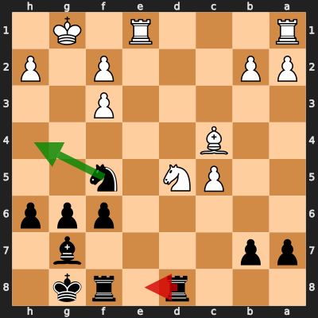

# Analysis: sio382 vs erivera90

**Date:** 2026.03.29 | **Event:** Live Chess | **Site:** Chess.com

## Rolling CLAMP (last 20 games)
_Window: **6** game(s) on file, **8** blunder(s). Tags recorded on **7** blunder(s). (One blunder can have multiple CLAMP tags.)_

| Letter | Category | Count | Share of tag hits |
|--------|----------|-------|-------------------|
| **C** | Checks | 5 | 36% |
| **L** | Loose pieces / squares | 1 | 7% |
| **A** | Alignments (forks, pins, lines) | 5 | 36% |
| **M** | Mobility / trapped piece | 1 | 7% |
| **P** | Passed pawns | 2 | 14% |

Found **1** crucial moments.

## Moment 1 — Blunder [MAJOR]

**Tactic:** Discovered Attack

- **CLAMP:** C · A
  - **C** (Checks): Opponent's best line includes a damaging check or forced mate.
  - **A** (Alignments (forks, pins, lines)): Tactical alignment: fork, pin, skewer, discovered attack, or mating line.

**FEN:** `3r1rk1/pp4b1/5ppp/2PN1n2/2B5/5P2/PP3P1P/R3R1K1 b - - 1 19`

- **You Played:** **Rde8** (Red Arrow)
- **Engine Best:** **Nh4** (Green Arrow)
- **Eval Swing:** -438 cp
- **Variation:** _Nh4 Re3_

**Refutation:** _Nc7+ Kh8 Rxe8 Rxe8 Nxe8 Nd4_

---
