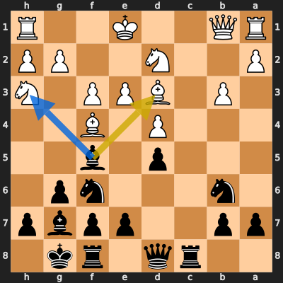
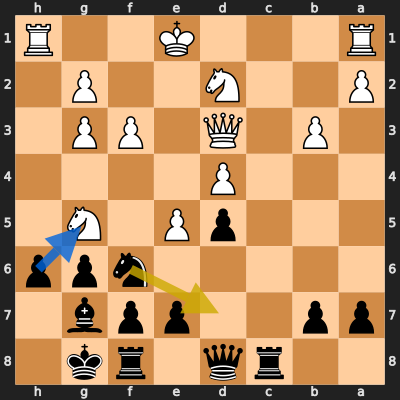
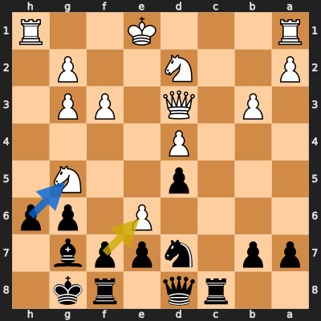
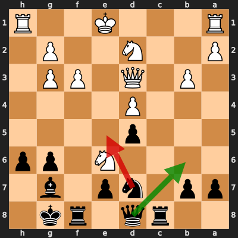
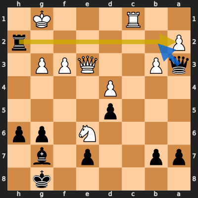
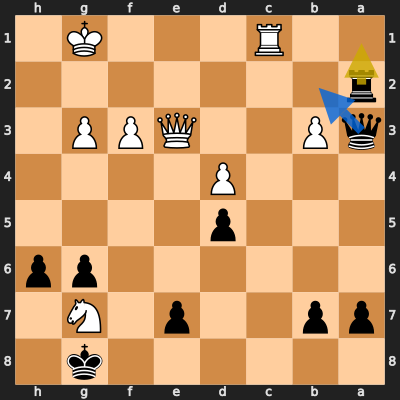
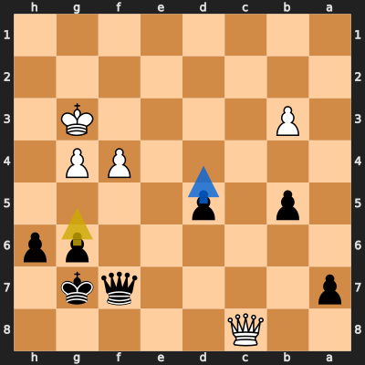
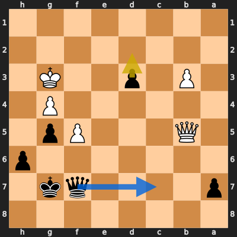

# Analysis: OhhhBaxter vs erivera90

**Date:** 2026.03.30 | **Event:** Live Chess | **Site:** Chess.com

## Rolling CLAMP (last 20 games)
_Window: **11** game(s) on file, **14** blunder(s). Tags recorded on **12** blunder(s). (One blunder can have multiple CLAMP tags.)_

| Letter | Category | Count | Share of tag hits |
|--------|----------|-------|-------------------|
| **C** | Checks | 6 | 27% |
| **L** | Loose pieces / squares | 3 | 14% |
| **A** | Alignments (forks, pins, lines) | 7 | 32% |
| **M** | Mobility / trapped piece | 1 | 5% |
| **P** | Passed pawns | 5 | 23% |

Found **8** crucial moments (1 blunder, 7 missed opportunitys).

## Moment 1 — Missed Opportunity [MINOR]

**Tactic:** Missed Positional

**FEN:** `2rq1rk1/pp2ppbp/1n3np1/3p1b2/3P1B2/1P1BPP1N/P2N2PP/RQ2K2R b KQ - 4 12`

- **You Played:** **Bxd3**
- **You Could Have Played:** **Bxh3**
- **Eval Swing:** -264 cp
- **Best Line:** _Bxh3 gxh3 Nh5 Bg5 Qd7 O-O_

---
## Moment 2 — Missed Opportunity [MINOR]

**Tactic:** Missed Hanging Piece

**FEN:** `2rq1rk1/pp2ppb1/5npp/3pP1N1/3P4/1P1Q1PP1/P2N2P1/R3K2R b KQ - 0 18`

- **You Played:** **Nd7**
- **You Could Have Played:** **hxg5**
- **Eval Swing:** -200 cp
- **Best Line:** _hxg5 exf6 Bxf6 Ke2 Qb6 Rad1_

---
## Moment 3 — Missed Opportunity [MAJOR]

**Tactic:** Missed Hanging Piece

**FEN:** `2rq1rk1/pp1nppb1/4P1pp/3p2N1/3P4/1P1Q1PP1/P2N2P1/R3K2R b KQ - 0 19`

- **You Played:** **fxe6**
- **You Could Have Played:** **hxg5**
- **Eval Swing:** -432 cp
- **Best Line:** _hxg5 exd7 Qxd7 Rd1 Qc7 Nf1_

---
## Moment 4 — Blunder [MAJOR]

**Tactic:** Pin

- **CLAMP:** A
  - **A** (Alignments (forks, pins, lines)): Tactical alignment: fork, pin, skewer, discovered attack, or mating line.

**FEN:** `2rq1rk1/pp1np1b1/4N1pp/3p4/3P4/1P1Q1PP1/P2N2P1/R3K2R b KQ - 0 20`

- **You Played:** **Ne5** (Red Arrow)
- **Engine Best:** **Qb6** (Green Arrow)
- **Eval Swing:** -329 cp
- **Variation:** _Qb6 Qxg6_

> **CRITICAL: Your move allowed the opponent to immediately capture your Black Knight on e5.**

**Refutation:** _dxe5 Qb6 Nxf8 Kxf8 Ke2 Bxe5_

---
## Moment 5 — Missed Opportunity [MAJOR]

**Tactic:** Missed back_rank_weakness

**FEN:** `6k1/pp2p1b1/4N1pp/3p4/3P4/qP2QPP1/P6r/2R3K1 b - - 1 27`

- **You Played:** **Rxa2**
- **You Could Have Played:** **Qb2**
- **Eval Swing:** -385 cp
- **Best Line:** _Qb2 Rc8+ Kh7 Nf4 Bxd4 Qxd4_

---
## Moment 6 — Missed Opportunity [CRITICAL]

**Tactic:** Missed Back-Rank Mate

**FEN:** `6k1/pp2p1N1/6pp/3p4/3P4/qP2QPP1/r7/2R3K1 b - - 0 28`

- **You Played:** **Ra1**
- **You Could Have Played:** **Qb2**
- **Eval Swing:** -10042 cp
- **Best Line:** _Qb2 Rc8+ Kh7 Rh8+ Kxh8 Qxh6+_

---
## Moment 7 — Missed Opportunity [MINOR]

**Tactic:** Missed Discovered Attack

**FEN:** `2Q5/p4qk1/6pp/1p1p4/5PP1/1P4K1/8/8 b - - 0 37`

- **You Played:** **g5**
- **You Could Have Played:** **d4**
- **Eval Swing:** -214 cp
- **Best Line:** _d4_

---
## Moment 8 — Missed Opportunity [MINOR]

**Tactic:** Missed Positional

**FEN:** `8/p4qk1/7p/1Q3Pp1/6P1/1P1p2K1/8/8 b - - 0 40`

- **You Played:** **d2**
- **You Could Have Played:** **Qc7+**
- **Eval Swing:** -217 cp
- **Best Line:** _Qc7+ Kg2 Qd6 Qb7+ Kf6 Qxa7_

---
