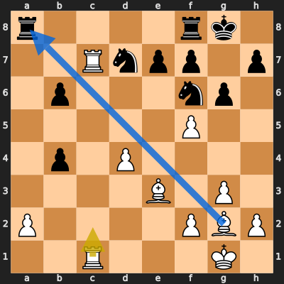
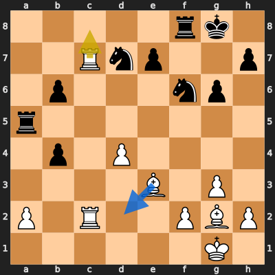
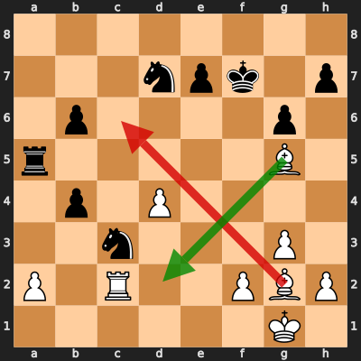
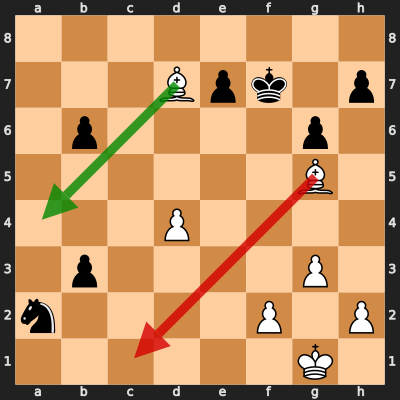
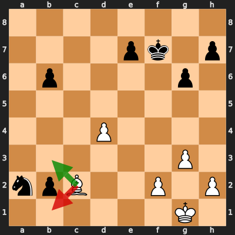

# Analysis: erivera90 vs Moby154

**Date:** 2026.03.30 | **Event:** Live Chess | **Site:** Chess.com

## Rolling CLAMP (last 20 games)
_Window: **10** game(s) on file, **11** blunder(s). Tags recorded on **10** blunder(s). (One blunder can have multiple CLAMP tags.)_

| Letter | Category | Count | Share of tag hits |
|--------|----------|-------|-------------------|
| **C** | Checks | 6 | 32% |
| **L** | Loose pieces / squares | 2 | 11% |
| **A** | Alignments (forks, pins, lines) | 7 | 37% |
| **M** | Mobility / trapped piece | 1 | 5% |
| **P** | Passed pawns | 3 | 16% |

Found **5** crucial moments (3 blunders, 2 missed opportunitys).

## Moment 1 — Missed Opportunity [MINOR]

**Tactic:** Missed Losing Exchange

**FEN:** `r4rk1/2Rnpp1p/1p3np1/5P2/1p1P4/4B1P1/P4PBP/2R3K1 w - - 1 19`

- **You Played:** **R1c2**
- **You Could Have Played:** **Bxa8**
- **Eval Swing:** -224 cp
- **Best Line:** _Bxa8 Rxa8 Bh6 Kh8 Rc8+ Rxc8_

---
## Moment 2 — Missed Opportunity [MINOR]

**Tactic:** Missed Pin

**FEN:** `5rk1/2Rnp2p/1p3np1/r7/1p1P4/4B1P1/P1R2PBP/6K1 w - - 0 21`

- **You Played:** **Rc8**
- **You Could Have Played:** **Bd2**
- **Eval Swing:** -273 cp
- **Best Line:** _Bd2 b3 axb3 Ra1+ Bf1 b5_

---
## Moment 3 — Blunder [MAJOR]

**Tactic:** Positional

**FEN:** `8/3npk1p/1p4p1/r5B1/1p1P4/2n3P1/P1R2PBP/6K1 w - - 5 25`

- **You Played:** **Bc6** (Red Arrow)
- **Engine Best:** **Bd2** (Green Arrow)
- **Eval Swing:** -356 cp
- **Variation:** _Bd2 e6_

**Refutation:** _Nb8 Bg2 Rxg5 d5 Rxd5 Bxd5+_

---
## Moment 4 — Blunder [CRITICAL]

**Tactic:** Hanging Piece

- **CLAMP:** L · P
  - **L** (Loose pieces / squares): Material was loose, hanging, or lost in an unfavorable exchange.
  - **P** (Passed pawns): Opponent's play creates or exploits a dangerous passed pawn.

**FEN:** `8/3Bpk1p/1p4p1/6B1/3P4/1p4P1/n4P1P/6K1 w - - 0 28`

- **You Played:** **Bc1** (Red Arrow)
- **Engine Best:** **Ba4** (Green Arrow)
- **Eval Swing:** -978 cp
- **Variation:** _Ba4 Nc3 Bxb3+ Ke8 Be3 Kd7_

> **CRITICAL: Your move allowed the opponent to immediately capture your White Bishop on c1.**

**Refutation:** _Nxc1 Ba4 Ne2+ Kg2 b2 Bc2_

---
## Moment 5 — Blunder [CRITICAL]

**Tactic:** Positional

- **CLAMP:** P
  - **P** (Passed pawns): Opponent's play creates or exploits a dangerous passed pawn.

**FEN:** `8/4pk1p/1p4p1/8/3P4/6P1/npB2P1P/6K1 w - - 2 31`

- **You Played:** **Bb1** (Red Arrow)
- **Engine Best:** **Bb3+** (Green Arrow)
- **Eval Swing:** -973 cp
- **Variation:** _Bb3+ Kf6 Bxa2 e5 d5 e4_

**Refutation:** _Nc3 Bd3 b1=Q+ Bxb1 Nxb1 d5_

---
