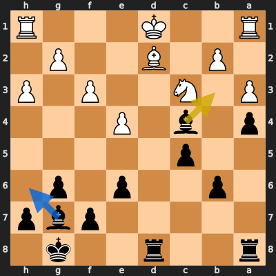

# Analysis: Terjefr vs erivera90

**Date:** 2026.03.31 | **Event:** Live Chess | **Site:** Chess.com

## Rolling CLAMP (last 20 games)
_Window: **14** game(s) on file, **17** blunder(s). Tags recorded on **15** blunder(s). (One blunder can have multiple CLAMP tags.)_

| Letter | Category | Count | Share of tag hits |
|--------|----------|-------|-------------------|
| **C** | Checks | 6 | 23% |
| **L** | Loose pieces / squares | 4 | 15% |
| **A** | Alignments (forks, pins, lines) | 9 | 35% |
| **M** | Mobility / trapped piece | 1 | 4% |
| **P** | Passed pawns | 6 | 23% |

Found **1** crucial moments (0 blunders, 1 missed opportunity).

## Moment 1 — Missed Opportunity [MINOR]

**Tactic:** Missed Trapped Piece

**FEN:** `r2r2k1/5pbp/1p2p1p1/2p5/p1b1P3/P1N2P1P/1P1B2P1/R2K3R b - - 0 20`

- **You Played:** **Bb3+**
- **You Could Have Played:** **Bh6**
- **Eval Swing:** -219 cp
- **Best Line:** _Bh6 Nd5 Bxd2 Kxd2 exd5 e5_

---
