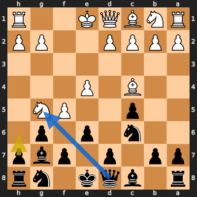
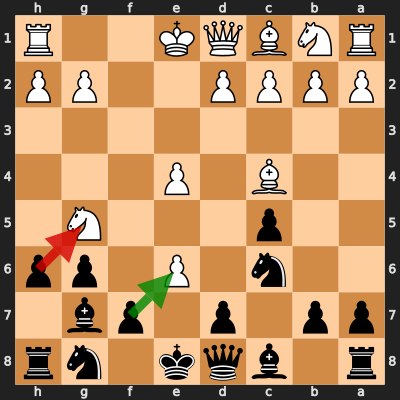
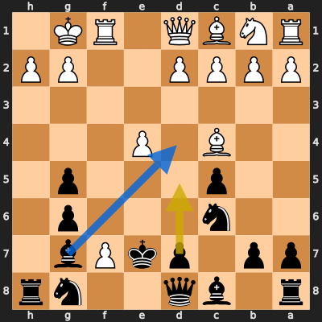
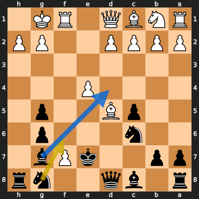
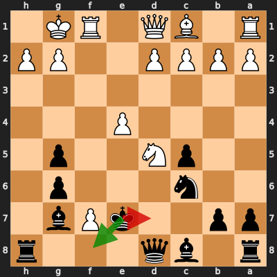
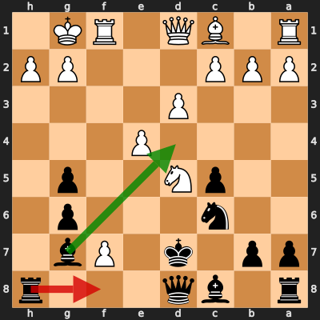
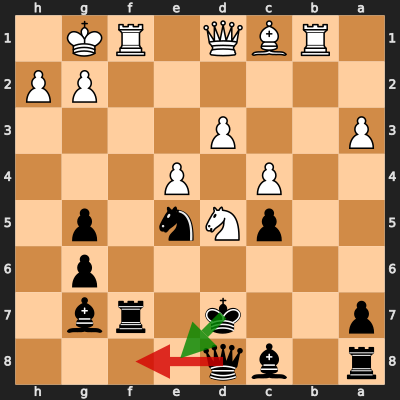
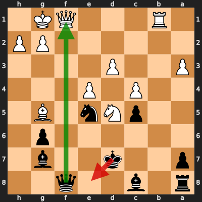
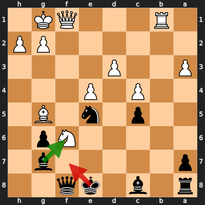

# Analysis: ZachHolder vs erivera90

**Date:** 2026.03.31 | **Event:** Live Chess | **Site:** Chess.com

## Rolling CLAMP (last 20 games)
_Window: **15** game(s) on file, **17** blunder(s). Tags recorded on **15** blunder(s). (One blunder can have multiple CLAMP tags.)_

| Letter | Category | Count | Share of tag hits |
|--------|----------|-------|-------------------|
| **C** | Checks | 6 | 23% |
| **L** | Loose pieces / squares | 4 | 15% |
| **A** | Alignments (forks, pins, lines) | 9 | 35% |
| **M** | Mobility / trapped piece | 1 | 4% |
| **P** | Passed pawns | 6 | 23% |

Found **9** crucial moments (6 blunders, 3 missed opportunitys).

## Moment 1 — Missed Opportunity [MINOR]

**Tactic:** Missed Pin

**FEN:** `r1bqk1nr/pp1p1pbp/2n1p1p1/2p2PN1/2B1P3/8/PPPP2PP/RNBQK2R b KQkq - 0 6`

- **You Played:** **h6**
- **You Could Have Played:** **Qxg5**
- **Eval Swing:** -201 cp
- **Best Line:** _Qxg5 O-O Qd8 d4 d5 exd5_

---
## Moment 2 — Blunder [CRITICAL]

**Tactic:** Fork

- **CLAMP:** C · A · P
  - **C** (Checks): Opponent's best line includes a damaging check or forced mate.
  - **A** (Alignments (forks, pins, lines)): Tactical alignment: fork, pin, skewer, discovered attack, or mating line.
  - **P** (Passed pawns): Opponent's play creates or exploits a dangerous passed pawn.

**FEN:** `r1bqk1nr/pp1p1pb1/2n1P1pp/2p3N1/2B1P3/8/PPPP2PP/RNBQK2R b KQkq - 0 7`

- **You Played:** **hxg5** (Red Arrow)
- **Engine Best:** **fxe6** (Green Arrow)
- **Eval Swing:** -548 cp
- **Variation:** _fxe6 Nh3 Nf6 O-O O-O Nf2_

> **CRITICAL: Your move allowed the opponent to immediately capture your Black Pawn on f7.**

**Refutation:** _exf7+ Ke7 fxg8=R Rxg8 Bxg8 Qxg8_

---
## Moment 3 — Missed Opportunity [MAJOR]

**Tactic:** Missed Pin

**FEN:** `r1bq2nr/pp1pkPb1/2n3p1/2p3p1/2B1P3/8/PPPP2PP/RNBQ1RK1 b - - 2 9`

- **You Played:** **d5**
- **You Could Have Played:** **Bd4+**
- **Eval Swing:** -416 cp
- **Best Line:** _Bd4+ Rf2 Nf6 Qe2 d5 exd5+_

---
## Moment 4 — Missed Opportunity [MINOR]

**Tactic:** Missed Trapped Piece

**FEN:** `r1bq2nr/pp2kPb1/2n3p1/2pB2p1/4P3/8/PPPP2PP/RNBQ1RK1 b - - 0 10`

- **You Played:** **Nf6**
- **You Could Have Played:** **Bd4+**
- **Eval Swing:** -268 cp
- **Best Line:** _Bd4+ Rf2 Nf6 h3 Qd6 Nc3_

---
## Moment 5 — Blunder [MAJOR]

**Tactic:** Discovered Attack

- **CLAMP:** A · P
  - **A** (Alignments (forks, pins, lines)): Tactical alignment: fork, pin, skewer, discovered attack, or mating line.
  - **P** (Passed pawns): Opponent's play creates or exploits a dangerous passed pawn.

**FEN:** `r1bq3r/pp2kPb1/2n3p1/2pN2p1/4P3/8/PPPP2PP/R1BQ1RK1 b - - 0 12`

- **You Played:** **Kd7** (Red Arrow)
- **Engine Best:** **Kf8** (Green Arrow)
- **Eval Swing:** -475 cp
- **Variation:** _Kf8 c3 Qd6 g3 Ne7 Nxe7_

**Refutation:** _d4 Bxd4+ Be3 Bxe3+ Nxe3+ Ke7_

---
## Moment 6 — Blunder [MINOR]

**Tactic:** Positional

- **CLAMP:** P
  - **P** (Passed pawns): Opponent's play creates or exploits a dangerous passed pawn.

**FEN:** `r1bq3r/pp1k1Pb1/2n3p1/2pN2p1/4P3/3P4/PPP3PP/R1BQ1RK1 b - - 0 13`

- **You Played:** **Rf8** (Red Arrow)
- **Engine Best:** **Bd4+** (Green Arrow)
- **Eval Swing:** -241 cp
- **Variation:** _Bd4+ Be3_

**Refutation:** _d4 Nb4 dxc5 Nxd5 exd5 Qe7_

---
## Moment 7 — Blunder [MINOR]

**Tactic:** Skewer

- **CLAMP:** C · A · P
  - **C** (Checks): Opponent's best line includes a damaging check or forced mate.
  - **A** (Alignments (forks, pins, lines)): Tactical alignment: fork, pin, skewer, discovered attack, or mating line.
  - **P** (Passed pawns): Opponent's play creates or exploits a dangerous passed pawn.

**FEN:** `r1bq4/p2k1rb1/6p1/2pNn1p1/2P1P3/P2P4/6PP/1RBQ1RK1 b - - 1 18`

- **You Played:** **Qf8** (Red Arrow)
- **Engine Best:** **Ke8** (Green Arrow)
- **Eval Swing:** -259 cp
- **Variation:** _Ke8 Rxf7 Kxf7 Be3 Be6 Bxc5_

> **CRITICAL: Your move allowed the opponent to immediately capture your Black Rook on f7.**

**Refutation:** _Rxf7+ Qxf7 Be3 Ke8 Bxc5 Be6_

---
## Moment 8 — Blunder [CRITICAL]

**Tactic:** Fork

- **CLAMP:** C · A · P
  - **C** (Checks): Opponent's best line includes a damaging check or forced mate.
  - **A** (Alignments (forks, pins, lines)): Tactical alignment: fork, pin, skewer, discovered attack, or mating line.
  - **P** (Passed pawns): Opponent's play creates or exploits a dangerous passed pawn.

**FEN:** `r1b2q2/p2k2b1/6p1/2pNn1B1/2P1P3/P2P4/6PP/1R3QK1 b - - 0 20`

- **You Played:** **Ke8** (Red Arrow)
- **Engine Best:** **Qxf1+** (Green Arrow)
- **Eval Swing:** -513 cp
- **Variation:** _Qxf1+ Rxf1 Rb8 h3 Rb7 Nf6+_

**Refutation:** _Nc7+ Kd7 Nxa8 Ba6 Qxf8 Bxf8_

---
## Moment 9 — Blunder [MAJOR]

**Tactic:** Discovered Attack

- **CLAMP:** C · A · P
  - **C** (Checks): Opponent's best line includes a damaging check or forced mate.
  - **A** (Alignments (forks, pins, lines)): Tactical alignment: fork, pin, skewer, discovered attack, or mating line.
  - **P** (Passed pawns): Opponent's play creates or exploits a dangerous passed pawn.

**FEN:** `r1b1kq2/p5b1/5Np1/2p1n1B1/2P1P3/P2P4/6PP/1R3QK1 b - - 2 21`

- **You Played:** **Kf7** (Red Arrow)
- **Engine Best:** **Bxf6** (Green Arrow)
- **Eval Swing:** -492 cp
- **Variation:** _Bxf6 Bxf6_

**Refutation:** _Nd7+ Kg8 Nxf8 Ng4 Kh1 Bd4_

---
