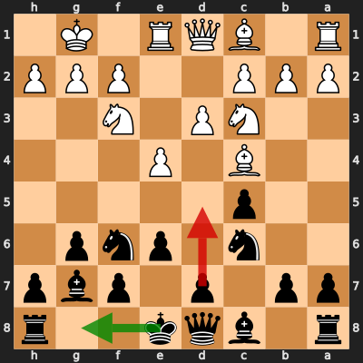
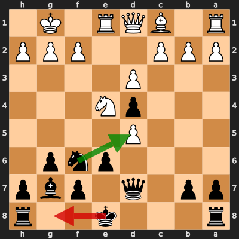
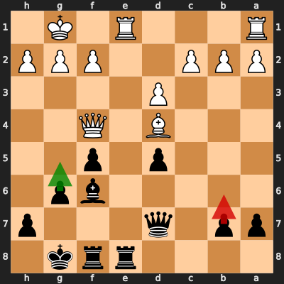
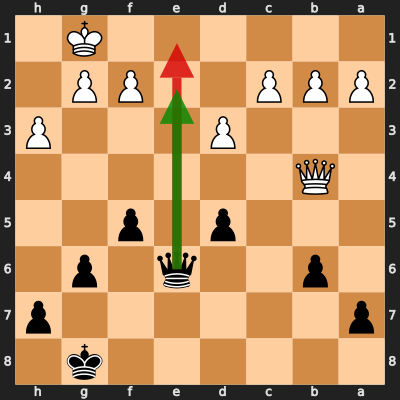

# Analysis: b00thy vs erivera90

**Date:** 2026.03.31 | **Event:** Live Chess | **Site:** Chess.com

## Rolling CLAMP (last 20 games)
_Window: **19** game(s) on file, **26** blunder(s). Tags recorded on **24** blunder(s). (One blunder can have multiple CLAMP tags.)_

| Letter | Category | Count | Share of tag hits |
|--------|----------|-------|-------------------|
| **C** | Checks | 11 | 23% |
| **L** | Loose pieces / squares | 5 | 11% |
| **A** | Alignments (forks, pins, lines) | 16 | 34% |
| **M** | Mobility / trapped piece | 1 | 2% |
| **P** | Passed pawns | 14 | 30% |

Found **4** crucial moments.

## Moment 1 — Blunder [MINOR]

**Tactic:** Pin

- **CLAMP:** A
  - **A** (Alignments (forks, pins, lines)): Tactical alignment: fork, pin, skewer, discovered attack, or mating line.

**FEN:** `r1bqk2r/pp1p1pbp/2n1pnp1/2p5/2B1P3/2NP1N2/PPP2PPP/R1BQR1K1 b kq - 1 7`

- **You Played:** **d5** (Red Arrow)
- **Engine Best:** **O-O** (Green Arrow)
- **Eval Swing:** -231 cp
- **Variation:** _O-O_

> **CRITICAL: Your move allowed the opponent to immediately capture your Black Pawn on d5.**

**Refutation:** _exd5_

---
## Moment 2 — Blunder [MINOR]

**Tactic:** Fork

- **CLAMP:** C · A
  - **C** (Checks): Opponent's best line includes a damaging check or forced mate.
  - **A** (Alignments (forks, pins, lines)): Tactical alignment: fork, pin, skewer, discovered attack, or mating line.

**FEN:** `r3k2r/pp1q1pbp/4pnp1/3P4/3pN3/3P4/PPP2PPP/R1BQR1K1 b kq - 1 12`

- **You Played:** **O-O** (Red Arrow)
- **Engine Best:** **Nxd5** (Green Arrow)
- **Eval Swing:** -206 cp
- **Variation:** _Nxd5_

> **CRITICAL: Your move allowed the opponent to immediately capture your Black Knight on f6.**

**Refutation:** _Nxf6+_

---
## Moment 3 — Blunder [CRITICAL]

**Tactic:** Positional

**FEN:** `4rrk1/pp1q3p/5bp1/3p1p2/3B1Q2/3P4/PPP2PPP/R3R1K1 b - - 5 19`

- **You Played:** **b6** (Red Arrow)
- **Engine Best:** **g5** (Green Arrow)
- **Eval Swing:** -533 cp
- **Variation:** _g5 Qd2 Bxd4 Qxg5+ Bg7 Kf1_

> **CRITICAL: Your move allowed the opponent to immediately capture your Black Bishop on f6.**

**Refutation:** _Bxf6 Rxf6 Rxe8+ Qxe8 Qd4 Qc6_

---
## Moment 4 — Blunder [CRITICAL]

**Tactic:** Hanging Piece

- **CLAMP:** L
  - **L** (Loose pieces / squares): Material was loose, hanging, or lost in an unfavorable exchange.

**FEN:** `6k1/p6p/1p2q1p1/3p1p2/1Q6/3P3P/PPP2PP1/6K1 b - - 0 24`

- **You Played:** **Qe1+** (Red Arrow)
- **Engine Best:** **Qe2** (Green Arrow)
- **Eval Swing:** -598 cp
- **Variation:** _Qe2 Qf4 Kf7 Qc7+ Qe7 Qxe7+_

> **CRITICAL: Your move allowed the opponent to immediately capture your Black Queen on e1.**

**Refutation:** _Qxe1 Kf7 Qc3 g5 Kf1 d4_

---
