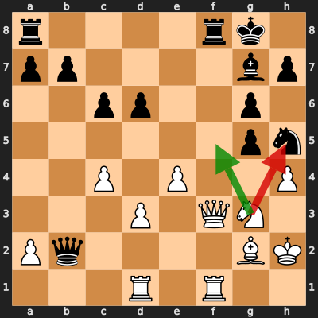

# Analysis: erivera90 vs Chirita1985

**Date:** 2026.03.31 | **Event:** Live Chess | **Site:** Chess.com

## Rolling CLAMP (last 20 games)
_Window: **13** game(s) on file, **16** blunder(s). Tags recorded on **14** blunder(s). (One blunder can have multiple CLAMP tags.)_

| Letter | Category | Count | Share of tag hits |
|--------|----------|-------|-------------------|
| **C** | Checks | 6 | 25% |
| **L** | Loose pieces / squares | 3 | 12% |
| **A** | Alignments (forks, pins, lines) | 9 | 38% |
| **M** | Mobility / trapped piece | 1 | 4% |
| **P** | Passed pawns | 5 | 21% |

Found **1** crucial moments.

## Moment 1 — Blunder [MINOR]

**Tactic:** Losing Exchange

- **CLAMP:** L · P
  - **L** (Loose pieces / squares): Material was loose, hanging, or lost in an unfavorable exchange.
  - **P** (Passed pawns): Opponent's play creates or exploits a dangerous passed pawn.

**FEN:** `r4rk1/pp4bp/2pp2p1/6pn/2P1P2P/3P1QN1/Pq4BK/3R1R2 w - - 0 23`

- **You Played:** **Nxh5** (Red Arrow)
- **Engine Best:** **Nf5** (Green Arrow)
- **Eval Swing:** -227 cp
- **Variation:** _Nf5 Be5+ Kg1 Ng3 Rf2 Qb6_

> **CRITICAL: Your move allowed the opponent to immediately capture your White Queen on f3.**

**Refutation:** _Rxf3 Rxf3 g4 Rff1 gxh5 c5_

---
