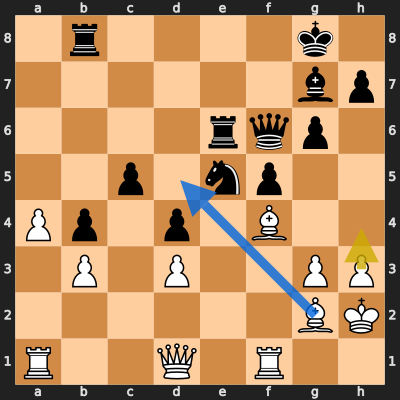
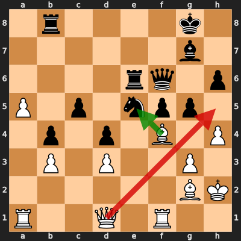
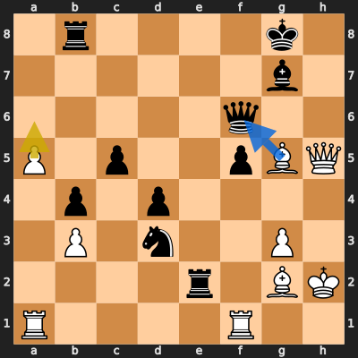

# Analysis: erivera90 vs Gerrido

**Date:** 2026.03.31 | **Event:** Live Chess | **Site:** Chess.com

## Rolling CLAMP (last 20 games)
_Window: **17** game(s) on file, **24** blunder(s). Tags recorded on **22** blunder(s). (One blunder can have multiple CLAMP tags.)_

| Letter | Category | Count | Share of tag hits |
|--------|----------|-------|-------------------|
| **C** | Checks | 11 | 25% |
| **L** | Loose pieces / squares | 4 | 9% |
| **A** | Alignments (forks, pins, lines) | 15 | 34% |
| **M** | Mobility / trapped piece | 1 | 2% |
| **P** | Passed pawns | 13 | 30% |

Found **3** crucial moments (1 blunder, 2 missed opportunitys).

## Moment 1 — Missed Opportunity [MINOR]

**Tactic:** Missed Pin

**FEN:** `1r4k1/6bp/4rqp1/2p1np2/Pp1p1B2/1P1P2PP/6BK/R2Q1R2 w - - 2 24`

- **You Played:** **h4**
- **You Could Have Played:** **Bd5**
- **Eval Swing:** -255 cp
- **Best Line:** _Bd5 Kh8 Bxe6 Qxe6 a5 h5_

---
## Moment 2 — Blunder [CRITICAL]

**Tactic:** Losing Exchange

- **CLAMP:** L
  - **L** (Loose pieces / squares): Material was loose, hanging, or lost in an unfavorable exchange.

**FEN:** `1r4k1/6b1/4rq1p/P1p1npp1/1p1p1B1P/1P1P2P1/6BK/R2Q1R2 w - - 0 26`

- **You Played:** **Qh5** (Red Arrow)
- **Engine Best:** **Bxe5** (Green Arrow)
- **Eval Swing:** -500 cp
- **Variation:** _Bxe5 Qxe5 a6 gxh4 Qf3 Rg6_

> **CRITICAL: Your move allowed the opponent to immediately capture your White Bishop on f4.**

**Refutation:** _gxf4_

---
## Moment 3 — Missed Opportunity [CRITICAL]

**Tactic:** Missed Losing Exchange

**FEN:** `1r4k1/6b1/5q2/P1p2pBQ/1p1p4/1P1n2P1/4r1BK/R4R2 w - - 1 29`

- **You Played:** **a6**
- **You Could Have Played:** **Bxf6**
- **Eval Swing:** -506 cp
- **Best Line:** _Bxf6 Rf8 Qxe2 Rxf6 Qxd3 c4_

---
