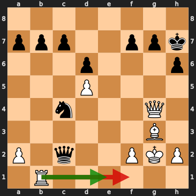

# Analysis: erivera90 vs damtraq

**Date:** 2026.03.31 | **Event:** Live Chess | **Site:** Chess.com

## Rolling CLAMP (last 20 games)
_Window: **16** game(s) on file, **23** blunder(s). Tags recorded on **21** blunder(s). (One blunder can have multiple CLAMP tags.)_

| Letter | Category | Count | Share of tag hits |
|--------|----------|-------|-------------------|
| **C** | Checks | 10 | 24% |
| **L** | Loose pieces / squares | 4 | 10% |
| **A** | Alignments (forks, pins, lines) | 14 | 34% |
| **M** | Mobility / trapped piece | 1 | 2% |
| **P** | Passed pawns | 12 | 29% |

Found **1** crucial moments.

## Moment 1 — Blunder [CRITICAL]

**Tactic:** Fork

- **CLAMP:** C · A · P
  - **C** (Checks): Opponent's best line includes a damaging check or forced mate.
  - **A** (Alignments (forks, pins, lines)): Tactical alignment: fork, pin, skewer, discovered attack, or mating line.
  - **P** (Passed pawns): Opponent's play creates or exploits a dangerous passed pawn.

**FEN:** `8/ppp2ppk/3p3p/3P4/2n3Q1/6B1/P1q2PKP/1R6 w - - 1 28`

- **You Played:** **Rf1** (Red Arrow)
- **Engine Best:** **Re1** (Green Arrow)
- **Eval Swing:** -1149 cp
- **Variation:** _Re1 Qd3 Qf3 Qg6 h4 f5_

**Refutation:** _Ne3+ Kg1 Nxg4 h4 Nf6 h5_

---
