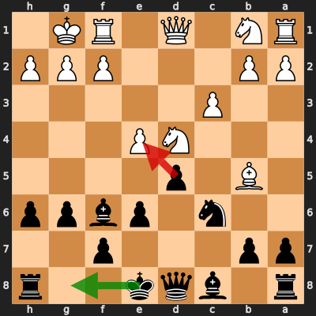
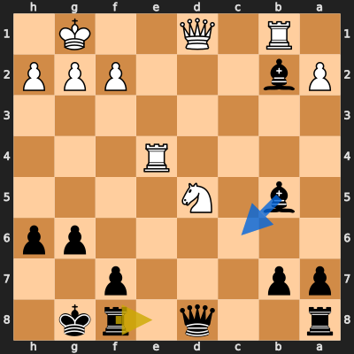

# Analysis: narelloc vs erivera90

**Date:** 2026.03.31 | **Event:** Live Chess | **Site:** Chess.com

## Rolling CLAMP (last 20 games)
_Window: **18** game(s) on file, **25** blunder(s). Tags recorded on **23** blunder(s). (One blunder can have multiple CLAMP tags.)_

| Letter | Category | Count | Share of tag hits |
|--------|----------|-------|-------------------|
| **C** | Checks | 11 | 24% |
| **L** | Loose pieces / squares | 5 | 11% |
| **A** | Alignments (forks, pins, lines) | 15 | 33% |
| **M** | Mobility / trapped piece | 1 | 2% |
| **P** | Passed pawns | 13 | 29% |

Found **2** crucial moments (1 blunder, 1 missed opportunity).

## Moment 1 — Blunder [MAJOR]

**Tactic:** Discovered Attack

- **CLAMP:** A · P
  - **A** (Alignments (forks, pins, lines)): Tactical alignment: fork, pin, skewer, discovered attack, or mating line.
  - **P** (Passed pawns): Opponent's play creates or exploits a dangerous passed pawn.

**FEN:** `r1bqk2r/pp3p2/2n1pbpp/1B1p4/3NP3/2P5/PP3PPP/RN1Q1RK1 b kq - 0 11`

- **You Played:** **dxe4** (Red Arrow)
- **Engine Best:** **O-O** (Green Arrow)
- **Eval Swing:** -319 cp
- **Variation:** _O-O Nb3 Qb6 a4 Rd8 N1d2_

> **CRITICAL: Your move allowed the opponent to immediately capture your Black Knight on c6.**

**Refutation:** _Nxc6 bxc6 Bxc6+ Bd7 Bxa8 Qxa8_

---
## Moment 2 — Missed Opportunity [MINOR]

**Tactic:** Missed Pin

**FEN:** `r2q1rk1/pp3p2/6pp/1b1N4/4R3/8/Pb3PPP/1R1Q2K1 b - - 1 18`

- **You Played:** **Re8**
- **You Could Have Played:** **Bc6**
- **Eval Swing:** -299 cp
- **Best Line:** _Bc6 Rxb2 Qxd5 Qxd5 Bxd5 Rd4_

---
