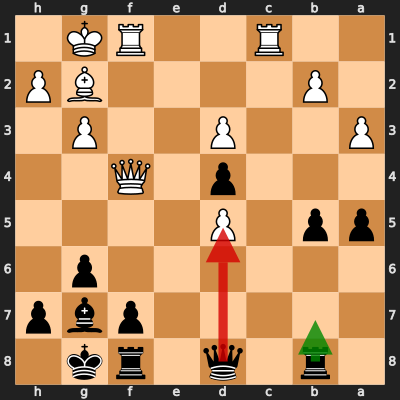

# Analysis: ssynthetic_dreams vs erivera90

**Date:** 2026.03.31 | **Event:** Live Chess | **Site:** Chess.com

## Rolling CLAMP (last 20 games)
_Window: **12** game(s) on file, **15** blunder(s). Tags recorded on **13** blunder(s). (One blunder can have multiple CLAMP tags.)_

| Letter | Category | Count | Share of tag hits |
|--------|----------|-------|-------------------|
| **C** | Checks | 6 | 26% |
| **L** | Loose pieces / squares | 3 | 13% |
| **A** | Alignments (forks, pins, lines) | 8 | 35% |
| **M** | Mobility / trapped piece | 1 | 4% |
| **P** | Passed pawns | 5 | 22% |

Found **1** crucial moments.

## Moment 1 — Blunder [CRITICAL]

**Tactic:** Pin

- **CLAMP:** A
  - **A** (Alignments (forks, pins, lines)): Tactical alignment: fork, pin, skewer, discovered attack, or mating line.

**FEN:** `1r1q1rk1/5pbp/6p1/pp1P4/3p1Q2/P2P2P1/1P4BP/2R2RK1 b - - 0 23`

- **You Played:** **Qxd5** (Red Arrow)
- **Engine Best:** **Rb7** (Green Arrow)
- **Eval Swing:** -595 cp
- **Variation:** _Rb7 d6_

> **CRITICAL: Your move allowed the opponent to immediately capture your Black Queen on d5.**

**Refutation:** _Bxd5 Kh8 Kh1 b4 axb4 axb4_

---
