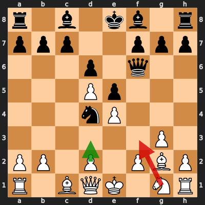
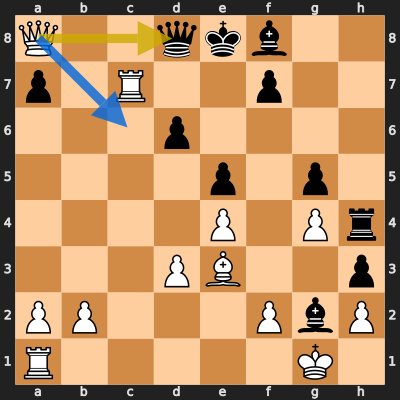
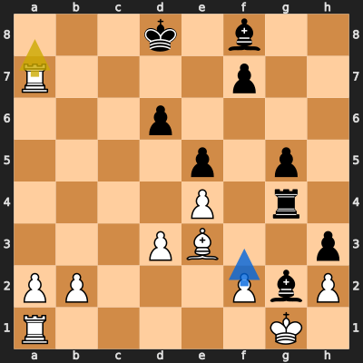
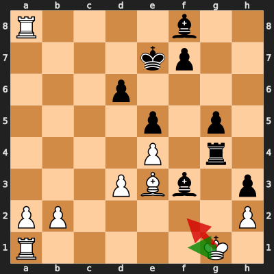

# Analysis: erivera90 vs Makar8avs

**Date:** 2026.04.02 | **Event:** Live Chess | **Site:** Chess.com

## Rolling CLAMP (last 20 games)
_Window: **20** game(s) on file, **30** blunder(s). Tags recorded on **27** blunder(s). (One blunder can have multiple CLAMP tags.)_

| Letter | Category | Count | Share of tag hits |
|--------|----------|-------|-------------------|
| **C** | Checks | 12 | 24% |
| **L** | Loose pieces / squares | 6 | 12% |
| **A** | Alignments (forks, pins, lines) | 18 | 35% |
| **M** | Mobility / trapped piece | 1 | 2% |
| **P** | Passed pawns | 14 | 27% |

Found **4** crucial moments (2 blunders, 2 missed opportunitys).

## Moment 1 — Blunder [MAJOR]

**Tactic:** Pin

- **CLAMP:** A
  - **A** (Alignments (forks, pins, lines)): Tactical alignment: fork, pin, skewer, discovered attack, or mating line.

**FEN:** `r1b1kb1r/ppp2ppp/3p1q2/3Pp3/3nP3/6P1/PP1P1PBP/R1BQK1NR w KQkq - 1 8`

- **You Played:** **Nf3** (Red Arrow)
- **Engine Best:** **d3** (Green Arrow)
- **Eval Swing:** -400 cp
- **Variation:** _d3 c5 dxc6 bxc6 Be3 Rb8_

**Refutation:** _Bg4 Kf1 Bxf3 Bxf3 Qxf3 Qxf3_

---
## Moment 2 — Missed Mate [CRITICAL]

**Tactic:** Missed Back-Rank Mate

**FEN:** `Q2qkb2/p1R2p2/3p4/4p1p1/4P1Pr/3PB2p/PP3PbP/R5K1 w - - 8 22`

- **You Played:** **Qxd8+**
- **You Could Have Played:** **Qc6+**
- **Eval Swing:** -9630 cp
- **Best Line:** _Qc6+ Qd7 Qxd7#_

---
## Moment 3 — Missed Opportunity [MAJOR]

**Tactic:** Missed back_rank_weakness

**FEN:** `3k1b2/R4p2/3p4/4p1p1/4P1r1/3PB2p/PP3PbP/R5K1 w - - 0 24`

- **You Played:** **Ra8+**
- **You Could Have Played:** **f3**
- **Eval Swing:** -381 cp
- **Best Line:** _f3 Bxf3+ Kf1 Ke8 Rc1 Be7_

---
## Moment 4 — Blunder [MINOR]

**Tactic:** Skewer

- **CLAMP:** C · A
  - **C** (Checks): Opponent's best line includes a damaging check or forced mate.
  - **A** (Alignments (forks, pins, lines)): Tactical alignment: fork, pin, skewer, discovered attack, or mating line.

**FEN:** `R4b2/4kp2/3p4/4p1p1/4P1r1/3PBb1p/PP5P/R5K1 w - - 0 26`

- **You Played:** **Kf2** (Red Arrow)
- **Engine Best:** **Kf1** (Green Arrow)
- **Eval Swing:** -238 cp
- **Variation:** _Kf1 Rg2 Rc1 Bg7 Rc6 Be2+_

**Refutation:** _Rg2+_

---
