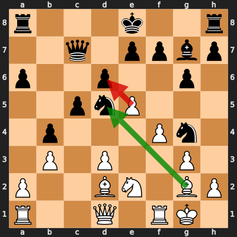
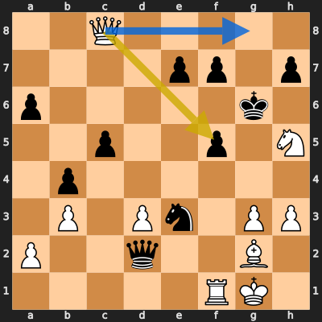

# Analysis: erivera90 vs May_G12

**Date:** 2026.04.02 | **Event:** Live Chess | **Site:** Chess.com

## Rolling CLAMP (last 20 games)
_Window: **20** game(s) on file, **30** blunder(s). Tags recorded on **28** blunder(s). (One blunder can have multiple CLAMP tags.)_

| Letter | Category | Count | Share of tag hits |
|--------|----------|-------|-------------------|
| **C** | Checks | 11 | 22% |
| **L** | Loose pieces / squares | 5 | 10% |
| **A** | Alignments (forks, pins, lines) | 21 | 43% |
| **M** | Mobility / trapped piece | 0 | 0% |
| **P** | Passed pawns | 12 | 24% |

Found **2** crucial moments (1 blunder, 1 missed opportunity).

## Moment 1 — Blunder [CRITICAL]

**Tactic:** Hanging Pawn

- **CLAMP:** L
  - **L** (Loose pieces / squares): Material was loose, hanging, or lost in an unfavorable exchange.

**FEN:** `r3k2r/2q1ppbp/p2p2p1/2pnP3/1p3Pn1/1P1P2P1/P2BN1BP/R2Q1RK1 w kq - 0 18`

- **You Played:** **exd6** (Red Arrow)
- **Engine Best:** **Bxd5** (Green Arrow)
- **Eval Swing:** -590 cp
- **Variation:** _Bxd5 Rd8 e6 f5 Rc1 Qc8_

> **CRITICAL: Your move allowed the opponent to immediately capture your White Pawn on d6.**

**Refutation:** _Qxd6 Rb1 O-O Qc1 Rac8 f5_

---
## Moment 2 — Missed Mate [CRITICAL]

**Tactic:** Missed Forced Mate

**FEN:** `2Q5/4pp1p/p5k1/2p2p1N/1p6/1P1Pn1PP/P2q2B1/5RK1 w - - 8 29`

- **You Played:** **Qxf5+**
- **You Could Have Played:** **Qg8+**
- **Eval Swing:** -10270 cp
- **Best Line:** _Qg8+ Kxh5 Qxh7+ Kg5 Qg7+ Kh5_

---
