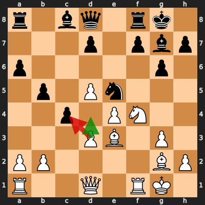
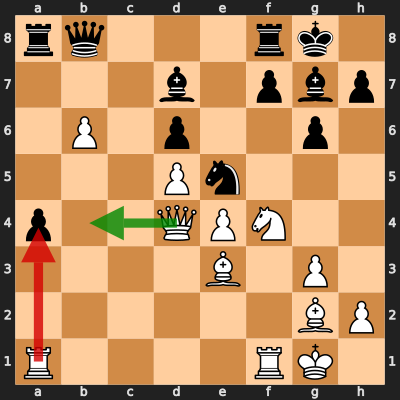

# Analysis: erivera90 vs T_TIMEE

**Date:** 2026.04.02 | **Event:** Live Chess | **Site:** Chess.com

## Rolling CLAMP (last 20 games)
_Window: **20** game(s) on file, **31** blunder(s). Tags recorded on **28** blunder(s). (One blunder can have multiple CLAMP tags.)_

| Letter | Category | Count | Share of tag hits |
|--------|----------|-------|-------------------|
| **C** | Checks | 12 | 24% |
| **L** | Loose pieces / squares | 5 | 10% |
| **A** | Alignments (forks, pins, lines) | 20 | 39% |
| **M** | Mobility / trapped piece | 1 | 2% |
| **P** | Passed pawns | 13 | 25% |

Found **2** crucial moments.

## Moment 1 — Blunder [MAJOR]

**Tactic:** Pin

- **CLAMP:** A
  - **A** (Alignments (forks, pins, lines)): Tactical alignment: fork, pin, skewer, discovered attack, or mating line.

**FEN:** `r1bq1rk1/3p1pbp/p5p1/1p1Pn3/2p1PN2/3PB1P1/PP4BP/R2Q1RK1 w - - 0 14`

- **You Played:** **dxc4** (Red Arrow)
- **Engine Best:** **d4** (Green Arrow)
- **Eval Swing:** -320 cp
- **Variation:** _d4 Nd3 Nxd3 cxd3 Qxd3 d6_

> **CRITICAL: Your move allowed the opponent to immediately capture your White Pawn on c4.**

**Refutation:** _Nxc4 Bd4_

---
## Moment 2 — Blunder [MAJOR]

**Tactic:** Skewer

- **CLAMP:** A
  - **A** (Alignments (forks, pins, lines)): Tactical alignment: fork, pin, skewer, discovered attack, or mating line.

**FEN:** `rq3rk1/3b1pbp/1P1p2p1/3Pn3/p2QPN2/4B1P1/6BP/R4RK1 w - - 1 21`

- **You Played:** **Rxa4** (Red Arrow)
- **Engine Best:** **Qb4** (Green Arrow)
- **Eval Swing:** -434 cp
- **Variation:** _Qb4_

> **CRITICAL: Your move allowed the opponent to immediately capture your White Rook on a4.**

**Refutation:** _Rxa4 Qd1 Rb4 Nd3 Nxd3 Qxd3_

---
