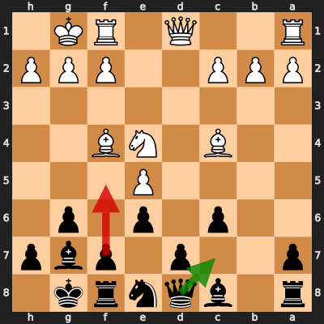
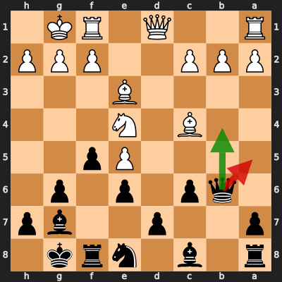
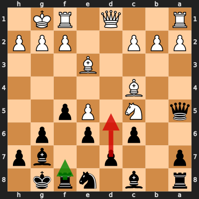

# Analysis: 100A10D11 vs erivera90

**Date:** 2026.04.03 | **Event:** Live Chess | **Site:** Chess.com

## Rolling CLAMP (last 20 games)
_Window: **20** game(s) on file, **30** blunder(s). Tags recorded on **28** blunder(s). (One blunder can have multiple CLAMP tags.)_

| Letter | Category | Count | Share of tag hits |
|--------|----------|-------|-------------------|
| **C** | Checks | 8 | 17% |
| **L** | Loose pieces / squares | 8 | 17% |
| **A** | Alignments (forks, pins, lines) | 18 | 38% |
| **M** | Mobility / trapped piece | 0 | 0% |
| **P** | Passed pawns | 13 | 28% |

Found **3** crucial moments.

## Moment 1 — Blunder [MINOR]

**Tactic:** Pin

- **CLAMP:** C · A
  - **C** (Checks): Opponent's best line includes a damaging check or forced mate.
  - **A** (Alignments (forks, pins, lines)): Tactical alignment: fork, pin, skewer, discovered attack, or mating line.

**FEN:** `r1bqnrk1/p2p1pbp/2p1p1p1/4P3/2B1NB2/8/PPP2PPP/R2Q1RK1 b - - 1 11`

- **You Played:** **f5** (Red Arrow)
- **Engine Best:** **Qc7** (Green Arrow)
- **Eval Swing:** -228 cp
- **Variation:** _Qc7_

> **CRITICAL: Your move allowed the opponent to immediately capture your Black Pawn on e6.**

**Refutation:** _Bxe6+ Kh8 Ng5 Qe7 Bc4 Nc7_

---
## Moment 2 — Blunder [MINOR]

**Tactic:** Pin

- **CLAMP:** A
  - **A** (Alignments (forks, pins, lines)): Tactical alignment: fork, pin, skewer, discovered attack, or mating line.

**FEN:** `r1b1nrk1/p2p2bp/1qp1p1p1/4Pp2/2B1N3/4B3/PPP2PPP/R2Q1RK1 b - - 3 13`

- **You Played:** **Qa5** (Red Arrow)
- **Engine Best:** **Qb4** (Green Arrow)
- **Eval Swing:** -246 cp
- **Variation:** _Qb4 Nd2_

**Refutation:** _Nc5 Rf7 Qd4 d5 Bd3 Nd6_

---
## Moment 3 — Blunder [MINOR]

**Tactic:** Pin

- **CLAMP:** A · P
  - **A** (Alignments (forks, pins, lines)): Tactical alignment: fork, pin, skewer, discovered attack, or mating line.
  - **P** (Passed pawns): Opponent's play creates or exploits a dangerous passed pawn.

**FEN:** `r1b1nrk1/p2p2bp/2p1p1p1/q1N1Pp2/2B5/4B3/PPP2PPP/R2Q1RK1 b - - 5 14`

- **You Played:** **d5** (Red Arrow)
- **Engine Best:** **Rf7** (Green Arrow)
- **Eval Swing:** -215 cp
- **Variation:** _Rf7 Qd4 Qb6 Rad1 d5 Bd3_

**Refutation:** _exd6 f4 Nxe6 Bxe6 Bxe6+ Kh8_

---
