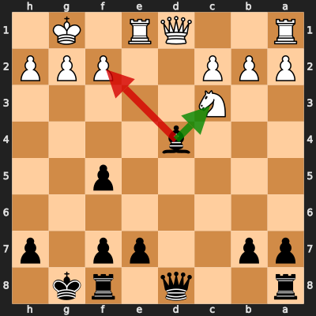
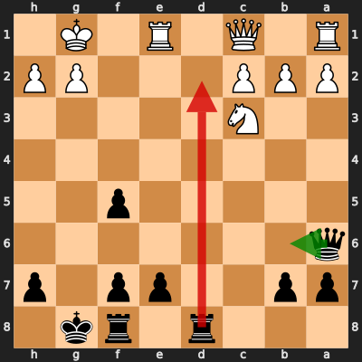

# Analysis: William_Dreemurrs vs erivera90

**Date:** 2026.04.03 | **Event:** Live Chess | **Site:** Chess.com

## Rolling CLAMP (last 20 games)
_Window: **20** game(s) on file, **30** blunder(s). Tags recorded on **28** blunder(s). (One blunder can have multiple CLAMP tags.)_

| Letter | Category | Count | Share of tag hits |
|--------|----------|-------|-------------------|
| **C** | Checks | 10 | 21% |
| **L** | Loose pieces / squares | 6 | 12% |
| **A** | Alignments (forks, pins, lines) | 20 | 42% |
| **M** | Mobility / trapped piece | 0 | 0% |
| **P** | Passed pawns | 12 | 25% |

Found **2** crucial moments.

## Moment 1 — Blunder [MAJOR]

**Tactic:** Hanging Piece

- **CLAMP:** L
  - **L** (Loose pieces / squares): Material was loose, hanging, or lost in an unfavorable exchange.

**FEN:** `r2q1rk1/pp2pp1p/8/5p2/3b4/2N5/PPP2PPP/R2QR1K1 b - - 1 14`

- **You Played:** **Bxf2+** (Red Arrow)
- **Engine Best:** **Bxc3** (Green Arrow)
- **Eval Swing:** -327 cp
- **Variation:** _Bxc3 bxc3_

> **CRITICAL: Your move allowed the opponent to immediately capture your Black Bishop on f2.**

**Refutation:** _Kxf2 Qb6+ Kf1 Qxb2 Qf3 Rfc8_

---
## Moment 2 — Blunder [MAJOR]

**Tactic:** Hanging Piece

- **CLAMP:** L · P
  - **L** (Loose pieces / squares): Material was loose, hanging, or lost in an unfavorable exchange.
  - **P** (Passed pawns): Opponent's play creates or exploits a dangerous passed pawn.

**FEN:** `3r1rk1/pp2pp1p/q7/5p2/8/2N5/PPP3PP/R1Q1R1K1 b - - 6 18`

- **You Played:** **Rd2** (Red Arrow)
- **Engine Best:** **Qb6+** (Green Arrow)
- **Eval Swing:** -305 cp
- **Variation:** _Qb6+ Kh1 e6 Qg5+ Kh8 Rad1_

> **CRITICAL: Your move allowed the opponent to immediately capture your Black Rook on d2.**

**Refutation:** _Qxd2 Qb6+ Kh1 e6 Rad1 Qxb2_

---
