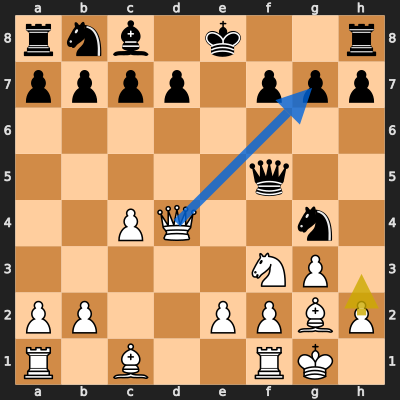
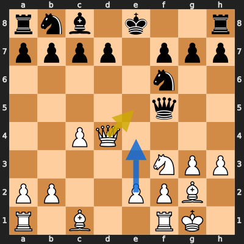
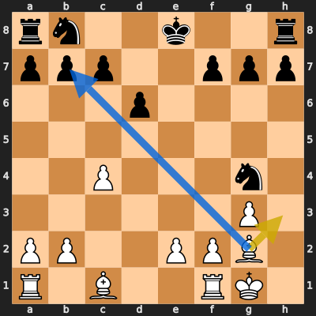
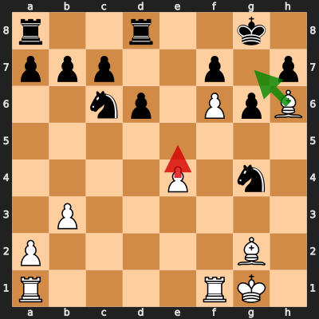
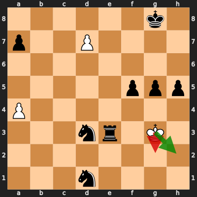

# Analysis: erivera90 vs Ranjith_0531

**Date:** 2026.04.03 | **Event:** Live Chess | **Site:** Chess.com

## Rolling CLAMP (last 20 games)
_Window: **20** game(s) on file, **32** blunder(s). Tags recorded on **30** blunder(s). (One blunder can have multiple CLAMP tags.)_

| Letter | Category | Count | Share of tag hits |
|--------|----------|-------|-------------------|
| **C** | Checks | 9 | 18% |
| **L** | Loose pieces / squares | 8 | 16% |
| **A** | Alignments (forks, pins, lines) | 20 | 39% |
| **M** | Mobility / trapped piece | 0 | 0% |
| **P** | Passed pawns | 14 | 27% |

Found **5** crucial moments (2 blunders, 3 missed opportunitys).

## Moment 1 — Missed Opportunity [MAJOR]

**Tactic:** Missed Hanging Pawn

**FEN:** `rnb1k2r/pppp1ppp/8/5q2/2PQ2n1/5NP1/PP2PPBP/R1B2RK1 w kq - 1 11`

- **You Played:** **h3**
- **You Could Have Played:** **Qxg7**
- **Eval Swing:** -349 cp
- **Best Line:** _Qxg7 Rf8 Nh4 Qh5 h3 d6_

---
## Moment 2 — Missed Opportunity [MINOR]

**Tactic:** Missed Skewer

**FEN:** `rnb1k2r/pppp1ppp/5n2/5q2/2PQ4/5NPP/PP2PPB1/R1B2RK1 w kq - 1 12`

- **You Played:** **Qe5+**
- **You Could Have Played:** **e4**
- **Eval Swing:** -221 cp
- **Best Line:** _e4 Qe6 Ng5 Qe7 e5 Ng8_

---
## Moment 3 — Missed Opportunity [CRITICAL]

**Tactic:** Missed Hanging Pawn

**FEN:** `rn2k2r/ppp2ppp/3p4/8/2P3n1/6P1/PP2PPB1/R1B2RK1 w kq - 0 16`

- **You Played:** **Bh3**
- **You Could Have Played:** **Bxb7**
- **Eval Swing:** -545 cp
- **Best Line:** _Bxb7 h5 Bxa8 h4 Bf3 Ne5_

---
## Moment 4 — Blunder [MINOR]

**Tactic:** Hanging Piece

- **CLAMP:** L · P
  - **L** (Loose pieces / squares): Material was loose, hanging, or lost in an unfavorable exchange.
  - **P** (Passed pawns): Opponent's play creates or exploits a dangerous passed pawn.

**FEN:** `r2r2k1/ppp2p1p/2np1PpB/8/4P1n1/1P6/P5B1/R4RK1 w - - 0 26`

- **You Played:** **e5** (Red Arrow)
- **Engine Best:** **Bg7** (Green Arrow)
- **Eval Swing:** -223 cp
- **Variation:** _Bg7 Nd4 Bh3 Ne5 Bh6 Re8_

> **CRITICAL: Your move allowed the opponent to immediately capture your White Bishop on h6.**

**Refutation:** _Nxh6 Rac1 dxe5 Bxc6 bxc6 Rxc6_

---
## Moment 5 — Blunder [CRITICAL]

**Tactic:** Back-Rank Mate

- **CLAMP:** C · A · P
  - **C** (Checks): Opponent's best line includes a damaging check or forced mate.
  - **A** (Alignments (forks, pins, lines)): Tactical alignment: fork, pin, skewer, discovered attack, or mating line.
  - **P** (Passed pawns): Opponent's play creates or exploits a dangerous passed pawn.

**FEN:** `6k1/p2P4/8/5ppp/P7/3nr1K1/8/3n4 w - - 1 53`

- **You Played:** **Kg2** (Red Arrow)
- **Engine Best:** **Kh2** (Green Arrow)
- **Eval Swing:** -9678 cp
- **Variation:** _Kh2 Kf7 d8=Q Re2+ Kg1 Re1+_

**Refutation:** _Nf4+ Kf1 Rd3 d8=Q+ Rxd8 a5_

---
