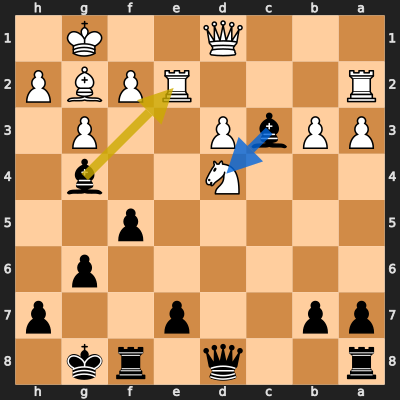

# Analysis: BadShaH7575 vs erivera90

**Date:** 2026.04.04 | **Event:** Live Chess | **Site:** Chess.com

## Rolling CLAMP (last 20 games)
_Window: **20** game(s) on file, **35** blunder(s). Tags recorded on **33** blunder(s). (One blunder can have multiple CLAMP tags.)_

| Letter | Category | Count | Share of tag hits |
|--------|----------|-------|-------------------|
| **C** | Checks | 10 | 18% |
| **L** | Loose pieces / squares | 9 | 16% |
| **A** | Alignments (forks, pins, lines) | 22 | 39% |
| **M** | Mobility / trapped piece | 0 | 0% |
| **P** | Passed pawns | 16 | 28% |

Found **1** crucial moments (0 blunders, 1 missed opportunity).

## Moment 1 — Missed Opportunity [MAJOR]

**Tactic:** Missed Pin

**FEN:** `r2q1rk1/pp2p2p/6p1/5p2/3N2b1/PPbP2P1/R3RPBP/3Q2K1 b - - 0 17`

- **You Played:** **Bxe2**
- **You Could Have Played:** **Bxd4**
- **Eval Swing:** -316 cp
- **Best Line:** _Bxd4 Qe1 Bxe2 Rxe2 e5 Rc2_

---
