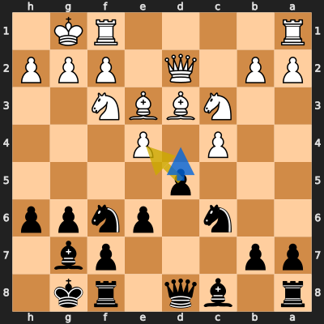
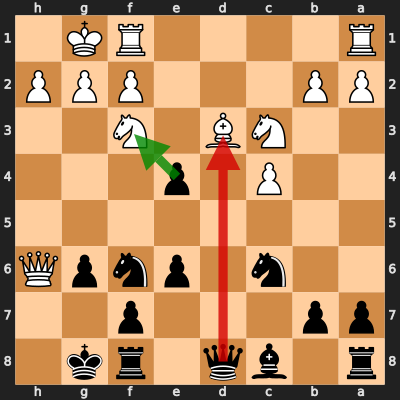
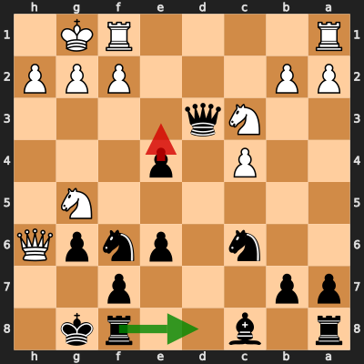
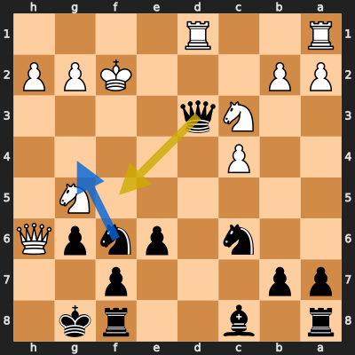
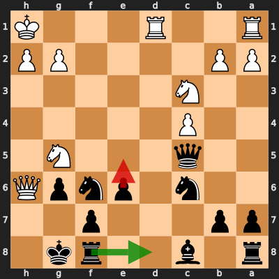

# Analysis: Obscuraz vs erivera90

**Date:** 2026.04.04 | **Event:** Live Chess | **Site:** Chess.com

## Rolling CLAMP (last 20 games)
_Window: **20** game(s) on file, **33** blunder(s). Tags recorded on **31** blunder(s). (One blunder can have multiple CLAMP tags.)_

| Letter | Category | Count | Share of tag hits |
|--------|----------|-------|-------------------|
| **C** | Checks | 9 | 17% |
| **L** | Loose pieces / squares | 9 | 17% |
| **A** | Alignments (forks, pins, lines) | 20 | 37% |
| **M** | Mobility / trapped piece | 0 | 0% |
| **P** | Passed pawns | 16 | 30% |

Found **5** crucial moments (3 blunders, 2 missed opportunitys).

## Moment 1 — Missed Opportunity [MINOR]

**Tactic:** Missed Fork

**FEN:** `r1bq1rk1/pp3pb1/2n1pnpp/3p4/2P1P3/2NBBN2/PP1Q1PPP/R4RK1 b - - 1 11`

- **You Played:** **dxe4**
- **You Could Have Played:** **d4**
- **Eval Swing:** -226 cp
- **Best Line:** _d4 Nxd4 Nxd4 Bxh6 e5 Bxg7_

---
## Moment 2 — Blunder [MAJOR]

**Tactic:** Pin

- **CLAMP:** A
  - **A** (Alignments (forks, pins, lines)): Tactical alignment: fork, pin, skewer, discovered attack, or mating line.

**FEN:** `r1bq1rk1/pp3p2/2n1pnpQ/8/2P1p3/2NB1N2/PP3PPP/R4RK1 b - - 0 13`

- **You Played:** **Qxd3** (Red Arrow)
- **Engine Best:** **exf3** (Green Arrow)
- **Eval Swing:** -461 cp
- **Variation:** _exf3 Rad1 Qe7 Be4 Ng4 Qh3_

**Refutation:** _Ng5_

---
## Moment 3 — Blunder [MAJOR]

**Tactic:** Pin

- **CLAMP:** A
  - **A** (Alignments (forks, pins, lines)): Tactical alignment: fork, pin, skewer, discovered attack, or mating line.

**FEN:** `r1b2rk1/pp3p2/2n1pnpQ/6N1/2P1p3/2Nq4/PP3PPP/R4RK1 b - - 1 14`

- **You Played:** **e3** (Red Arrow)
- **Engine Best:** **Rd8** (Green Arrow)
- **Eval Swing:** -342 cp
- **Variation:** _Rd8 Rad1_

> **CRITICAL: Your move allowed the opponent to immediately capture your Black Pawn on e3.**

**Refutation:** _fxe3 Qxe3+ Kh1 Qxg5 Qxg5 Nh7_

---
## Moment 4 — Missed Opportunity [CRITICAL]

**Tactic:** Missed Fork

**FEN:** `r1b2rk1/pp3p2/2n1pnpQ/6N1/2P5/2Nq4/PP3KPP/R2R4 b - - 0 16`

- **You Played:** **Qf5+**
- **You Could Have Played:** **Ng4+**
- **Eval Swing:** -912 cp
- **Best Line:** _Ng4+ Ke1 Qe3+ Ne2 Qf2+ Kd2_

---
## Moment 5 — Blunder [CRITICAL]

**Tactic:** Back-Rank Mate

- **CLAMP:** C · A
  - **C** (Checks): Opponent's best line includes a damaging check or forced mate.
  - **A** (Alignments (forks, pins, lines)): Tactical alignment: fork, pin, skewer, discovered attack, or mating line.

**FEN:** `r1b2rk1/pp3p2/2n1pnpQ/2q3N1/2P5/2N5/PP4PP/R2R3K b - - 4 18`

- **You Played:** **e5** (Red Arrow)
- **Engine Best:** **Rd8** (Green Arrow)
- **Eval Swing:** -9966 cp
- **Variation:** _Rd8 Rxd8+ Nxd8 Nce4 Qf5 Ng3_

**Refutation:** _Nce4 Qe7 Nxf6+ Qxf6 Qh7#_

---
