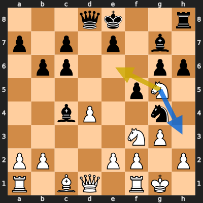

# Analysis: erivera90 vs NolanBadAtChess

**Date:** 2026.04.04 | **Event:** Live Chess | **Site:** Chess.com

## Rolling CLAMP (last 20 games)
_Window: **20** game(s) on file, **33** blunder(s). Tags recorded on **31** blunder(s). (One blunder can have multiple CLAMP tags.)_

| Letter | Category | Count | Share of tag hits |
|--------|----------|-------|-------------------|
| **C** | Checks | 9 | 17% |
| **L** | Loose pieces / squares | 9 | 17% |
| **A** | Alignments (forks, pins, lines) | 20 | 37% |
| **M** | Mobility / trapped piece | 0 | 0% |
| **P** | Passed pawns | 16 | 30% |

Found **1** crucial moments (0 blunders, 1 missed opportunity).

## Moment 1 — Missed Opportunity [MINOR]

**Tactic:** Missed Discovered Attack

**FEN:** `3qk2r/p1p1p1b1/1pp3pp/5pN1/2bP2n1/5NP1/PP2PP1P/R1BQ1RK1 w k - 0 12`

- **You Played:** **Ne6**
- **You Could Have Played:** **Nh3**
- **Eval Swing:** -232 cp
- **Best Line:** _Nh3 g5 Qc2 Qd5 Rd1 Kd8_

---
