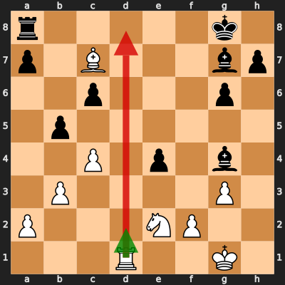

# Analysis: erivera90 vs limgui

**Date:** 2026.04.04 | **Event:** Live Chess | **Site:** Chess.com

## Rolling CLAMP (last 20 games)
_Window: **20** game(s) on file, **32** blunder(s). Tags recorded on **31** blunder(s). (One blunder can have multiple CLAMP tags.)_

| Letter | Category | Count | Share of tag hits |
|--------|----------|-------|-------------------|
| **C** | Checks | 10 | 19% |
| **L** | Loose pieces / squares | 8 | 15% |
| **A** | Alignments (forks, pins, lines) | 22 | 41% |
| **M** | Mobility / trapped piece | 0 | 0% |
| **P** | Passed pawns | 14 | 26% |

Found **1** crucial moments.

## Moment 1 — Blunder [MAJOR]

**Tactic:** Positional

**FEN:** `r5k1/p1B3bp/2p3p1/1p6/2P1p1b1/1P4P1/P3NP2/3R2K1 w - - 2 22`

- **You Played:** **Rd8+** (Red Arrow)
- **Engine Best:** **Rd2** (Green Arrow)
- **Eval Swing:** -302 cp
- **Variation:** _Rd2 bxc4_

> **CRITICAL: Your move allowed the opponent to immediately capture your White Rook on d8.**

**Refutation:** _Rxd8 Bxd8 Bxe2 cxb5 Bxb5 Be7_

---
