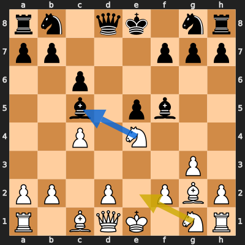
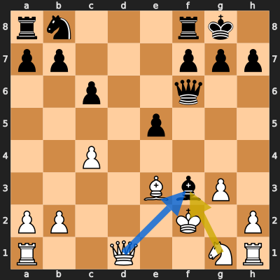
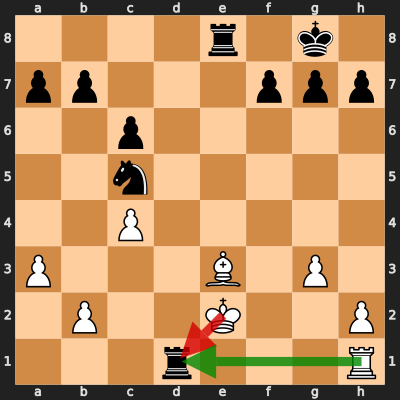

# Analysis: erivera90 vs new-user-777

**Date:** 2026.04.04 | **Event:** Live Chess | **Site:** Chess.com

## Rolling CLAMP (last 20 games)
_Window: **20** game(s) on file, **35** blunder(s). Tags recorded on **33** blunder(s). (One blunder can have multiple CLAMP tags.)_

| Letter | Category | Count | Share of tag hits |
|--------|----------|-------|-------------------|
| **C** | Checks | 10 | 18% |
| **L** | Loose pieces / squares | 9 | 16% |
| **A** | Alignments (forks, pins, lines) | 22 | 39% |
| **M** | Mobility / trapped piece | 0 | 0% |
| **P** | Passed pawns | 16 | 28% |

Found **3** crucial moments (1 blunder, 2 missed opportunitys).

## Moment 1 — Missed Opportunity [MAJOR]

**Tactic:** Missed Hanging Piece

**FEN:** `rn1qk1nr/pp3ppp/2p5/2b1pb2/2P1N3/6P1/PP1P1PBP/R1BQK1NR w KQkq - 1 7`

- **You Played:** **Ne2**
- **You Could Have Played:** **Nxc5**
- **Eval Swing:** -449 cp
- **Best Line:** _Nxc5 Nd7 Ne4 Bxe4 Bxe4 Nc5_

---
## Moment 2 — Missed Opportunity [MINOR]

**Tactic:** Missed Skewer

**FEN:** `rn3rk1/pp3ppp/2p2q2/4p3/2P5/4BbP1/PP3K1P/R2Q2NR w - - 0 14`

- **You Played:** **Nxf3**
- **You Could Have Played:** **Qxf3**
- **Eval Swing:** -244 cp
- **Best Line:** _Qxf3_

---
## Moment 3 — Blunder [MAJOR]

**Tactic:** Hanging Piece

- **CLAMP:** L · P
  - **L** (Loose pieces / squares): Material was loose, hanging, or lost in an unfavorable exchange.
  - **P** (Passed pawns): Opponent's play creates or exploits a dangerous passed pawn.

**FEN:** `4r1k1/pp3ppp/2p5/2n5/2P5/P3B1P1/1P2K2P/3r3R w - - 0 22`

- **You Played:** **Kxd1** (Red Arrow)
- **Engine Best:** **Rxd1** (Green Arrow)
- **Eval Swing:** -492 cp
- **Variation:** _Rxd1 Kf8 b4 Na4 Rd7 Nb2_

> **CRITICAL: Your move allowed the opponent to immediately capture your White Bishop on e3.**

**Refutation:** _Rxe3 Re1 Rxe1+ Kxe1 Nd3+ Kd2_

---
