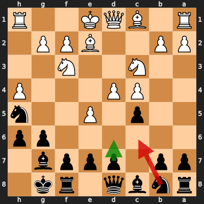
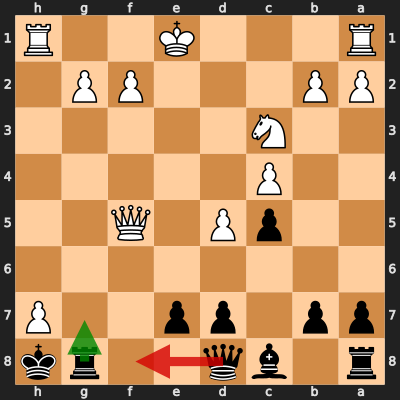
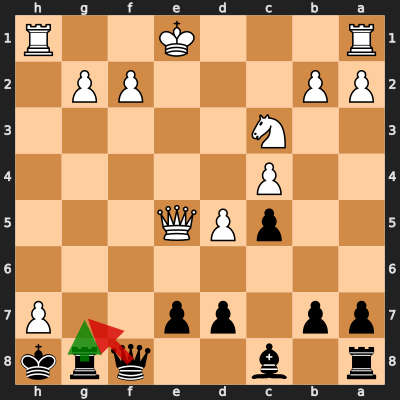
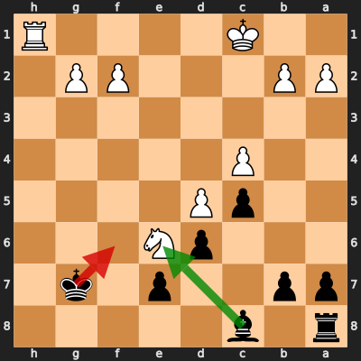
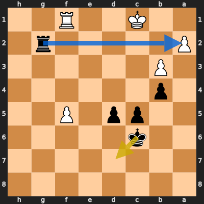
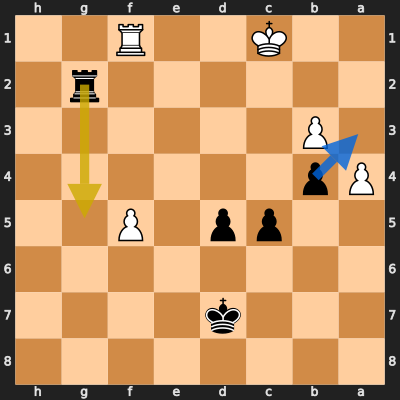
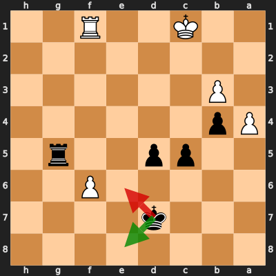

# Analysis: Lucide75 vs erivera90

**Date:** 2026.04.05 | **Event:** Live Chess | **Site:** Chess.com

## Rolling CLAMP (last 20 games)
_Window: **20** game(s) on file, **34** blunder(s). Tags recorded on **32** blunder(s). (One blunder can have multiple CLAMP tags.)_

| Letter | Category | Count | Share of tag hits |
|--------|----------|-------|-------------------|
| **C** | Checks | 13 | 22% |
| **L** | Loose pieces / squares | 8 | 13% |
| **A** | Alignments (forks, pins, lines) | 23 | 38% |
| **M** | Mobility / trapped piece | 0 | 0% |
| **P** | Passed pawns | 16 | 27% |

Found **7** crucial moments (5 blunders, 2 missed opportunitys).

## Moment 1 — Blunder [MINOR]

**Tactic:** Positional

**FEN:** `rnbq1rk1/pp1pppb1/6pp/2p1P2n/2PP3P/2N2N2/PP2BPP1/R1BQK2R b KQ - 0 8`

- **You Played:** **Nc6** (Red Arrow)
- **Engine Best:** **d6** (Green Arrow)
- **Eval Swing:** -205 cp
- **Variation:** _d6_

**Refutation:** _d5_

---
## Moment 2 — Blunder [CRITICAL]

**Tactic:** Back-Rank Mate

- **CLAMP:** C · A · P
  - **C** (Checks): Opponent's best line includes a damaging check or forced mate.
  - **A** (Alignments (forks, pins, lines)): Tactical alignment: fork, pin, skewer, discovered attack, or mating line.
  - **P** (Passed pawns): Opponent's play creates or exploits a dangerous passed pawn.

**FEN:** `r1bq2rk/pp1pp2P/8/2pP1Q2/2P5/2N5/PP3PP1/R3K2R b KQ - 0 19`

- **You Played:** **Qf8** (Red Arrow)
- **Engine Best:** **Rg7** (Green Arrow)
- **Eval Swing:** -9711 cp
- **Variation:** _Rg7 d6 b6 Ne2 exd6 Nf4_

> **CRITICAL: Your move allowed the opponent to immediately capture your Black Rook on g8.**

**Refutation:** _hxg8=R+ Kxg8 Qh7#_

---
## Moment 3 — Blunder [MAJOR]

**Tactic:** Pin

- **CLAMP:** C · A · P
  - **C** (Checks): Opponent's best line includes a damaging check or forced mate.
  - **A** (Alignments (forks, pins, lines)): Tactical alignment: fork, pin, skewer, discovered attack, or mating line.
  - **P** (Passed pawns): Opponent's play creates or exploits a dangerous passed pawn.

**FEN:** `r1b2qrk/pp1pp2P/8/2pPQ3/2P5/2N5/PP3PP1/R3K2R b KQ - 2 20`

- **You Played:** **Qg7** (Red Arrow)
- **Engine Best:** **Rg7** (Green Arrow)
- **Eval Swing:** -420 cp
- **Variation:** _Rg7 d6 exd6 Qd5 Rb8 Nb5_

> **CRITICAL: Your move allowed the opponent to immediately capture your Black Rook on g8.**

**Refutation:** _hxg8=Q+ Kxg8 Qxg7+ Kxg7 Kd2 d6_

---
## Moment 4 — Blunder [MAJOR]

**Tactic:** Positional

- **CLAMP:** P
  - **P** (Passed pawns): Opponent's play creates or exploits a dangerous passed pawn.

**FEN:** `r1b5/pp2p1k1/3pN3/2pP4/2P5/8/PP3PP1/2K4R b - - 2 26`

- **You Played:** **Kf6** (Red Arrow)
- **Engine Best:** **Bxe6** (Green Arrow)
- **Eval Swing:** -367 cp
- **Variation:** _Bxe6_

**Refutation:** _Nc7 Rb8 Rh8 Ke5 b3 a6_

---
## Moment 5 — Missed Opportunity [MINOR]

**Tactic:** Missed Hanging Pawn

**FEN:** `8/8/2k5/2pp1P2/1p6/1P6/P5r1/2K2R2 b - - 0 40`

- **You Played:** **Kd7**
- **You Could Have Played:** **Rxa2**
- **Eval Swing:** -213 cp
- **Best Line:** _Rxa2_

---
## Moment 6 — Missed Opportunity [MINOR]

**Tactic:** Missed Hanging Pawn

**FEN:** `8/3k4/8/2pp1P2/Pp6/1P6/6r1/2K2R2 b - a3 0 41`

- **You Played:** **Rg5**
- **You Could Have Played:** **bxa3**
- **Eval Swing:** -293 cp
- **Best Line:** _bxa3 Kb1 Rb2+ Ka1 Rxb3 Ka2_

---
## Moment 7 — Blunder [CRITICAL]

**Tactic:** Positional

- **CLAMP:** P
  - **P** (Passed pawns): Opponent's play creates or exploits a dangerous passed pawn.

**FEN:** `8/3k4/5P2/2pp2r1/Pp6/1P6/8/2K2R2 b - - 0 42`

- **You Played:** **Ke6** (Red Arrow)
- **Engine Best:** **Ke8** (Green Arrow)
- **Eval Swing:** -713 cp
- **Variation:** _Ke8 a5_

**Refutation:** _f7 Rf5 Rxf5 Kxf5 f8=Q+ Ke5_

---
