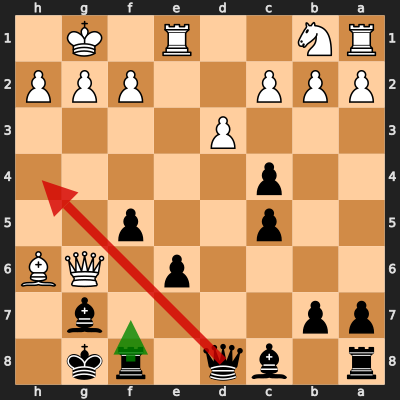

# Analysis: Rulinator vs erivera90

**Date:** 2026.04.05 | **Event:** Live Chess | **Site:** Chess.com

## Rolling CLAMP (last 20 games)
_Window: **20** game(s) on file, **32** blunder(s). Tags recorded on **30** blunder(s). (One blunder can have multiple CLAMP tags.)_

| Letter | Category | Count | Share of tag hits |
|--------|----------|-------|-------------------|
| **C** | Checks | 10 | 19% |
| **L** | Loose pieces / squares | 8 | 15% |
| **A** | Alignments (forks, pins, lines) | 21 | 40% |
| **M** | Mobility / trapped piece | 0 | 0% |
| **P** | Passed pawns | 14 | 26% |

Found **1** crucial moments.

## Moment 1 — Blunder [CRITICAL]

**Tactic:** Back-Rank Mate

- **CLAMP:** C · A · P
  - **C** (Checks): Opponent's best line includes a damaging check or forced mate.
  - **A** (Alignments (forks, pins, lines)): Tactical alignment: fork, pin, skewer, discovered attack, or mating line.
  - **P** (Passed pawns): Opponent's play creates or exploits a dangerous passed pawn.

**FEN:** `r1bq1rk1/pp4b1/4p1QB/2p2p2/2p5/3P4/PPP2PPP/RN2R1K1 b - - 1 17`

- **You Played:** **Qh4** (Red Arrow)
- **Engine Best:** **Rf7** (Green Arrow)
- **Eval Swing:** -9761 cp
- **Variation:** _Rf7 Bg5 Qe8 dxc4 Rf8 Qxe8_

> **CRITICAL: Your move allowed the opponent to immediately capture your Black Bishop on g7.**

**Refutation:** _Qxg7#_

---
