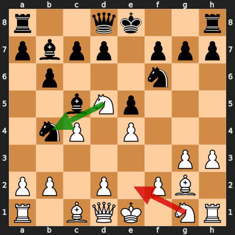
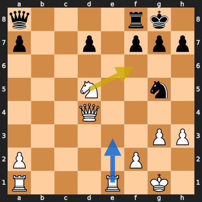
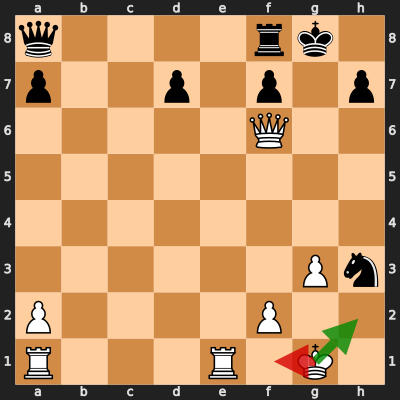

# Analysis: erivera90 vs Ahmed_7733

**Date:** 2026.04.05 | **Event:** Live Chess | **Site:** Chess.com

## Rolling CLAMP (last 20 games)
_Window: **20** game(s) on file, **32** blunder(s). Tags recorded on **30** blunder(s). (One blunder can have multiple CLAMP tags.)_

| Letter | Category | Count | Share of tag hits |
|--------|----------|-------|-------------------|
| **C** | Checks | 11 | 20% |
| **L** | Loose pieces / squares | 8 | 15% |
| **A** | Alignments (forks, pins, lines) | 21 | 39% |
| **M** | Mobility / trapped piece | 0 | 0% |
| **P** | Passed pawns | 14 | 26% |

Found **3** crucial moments (2 blunders, 1 missed opportunity).

## Moment 1 — Blunder [MAJOR]

**Tactic:** Fork

- **CLAMP:** C · A · P
  - **C** (Checks): Opponent's best line includes a damaging check or forced mate.
  - **A** (Alignments (forks, pins, lines)): Tactical alignment: fork, pin, skewer, discovered attack, or mating line.
  - **P** (Passed pawns): Opponent's play creates or exploits a dangerous passed pawn.

**FEN:** `r2qk2r/pbpp1ppp/1p3n2/2bNp3/1nP1P3/6PP/PP1P1PB1/R1BQK1NR w KQkq - 1 8`

- **You Played:** **Ne2** (Red Arrow)
- **Engine Best:** **Nxb4** (Green Arrow)
- **Eval Swing:** -386 cp
- **Variation:** _Nxb4_

**Refutation:** _Nd3+ Kf1 Nxd5 cxd5 Nxf2 Qb3_

---
## Moment 2 — Missed Opportunity [MAJOR]

**Tactic:** Missed back_rank_weakness

**FEN:** `q4rk1/p2p1ppp/8/3N2n1/3Q4/6PP/P4P2/R3R1K1 w - - 1 24`

- **You Played:** **Nf6+**
- **You Could Have Played:** **Re3**
- **Eval Swing:** -444 cp
- **Best Line:** _Re3 Re8 h4 Rxe3 Qxe3 Ne6_

---
## Moment 3 — Blunder [CRITICAL]

**Tactic:** Skewer

- **CLAMP:** C · A · P
  - **C** (Checks): Opponent's best line includes a damaging check or forced mate.
  - **A** (Alignments (forks, pins, lines)): Tactical alignment: fork, pin, skewer, discovered attack, or mating line.
  - **P** (Passed pawns): Opponent's play creates or exploits a dangerous passed pawn.

**FEN:** `q4rk1/p2p1p1p/5Q2/8/8/6Pn/P4P2/R3R1K1 w - - 0 26`

- **You Played:** **Kf1** (Red Arrow)
- **Engine Best:** **Kh2** (Green Arrow)
- **Eval Swing:** -988 cp
- **Variation:** _Kh2 Nxf2 Qxf2 Qd5 Rad1 Qg5_

**Refutation:** _Qh1+ Ke2 Re8+ Kd3 Qd5+ Kc2_

---
