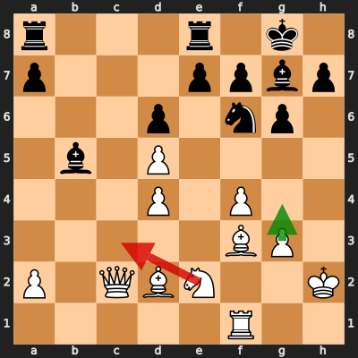
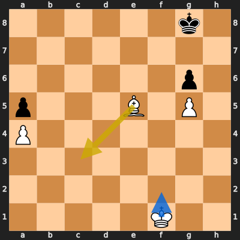
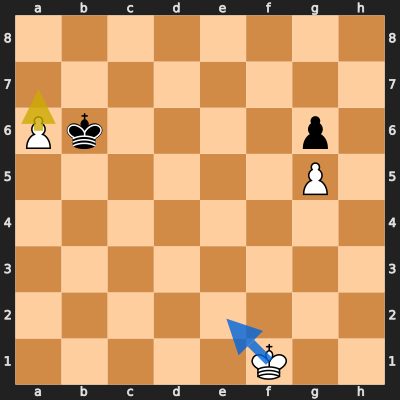
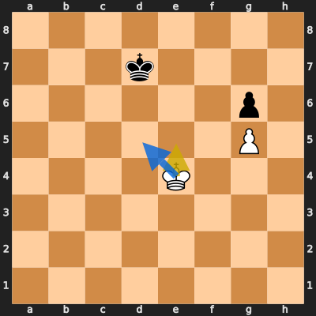

# Analysis: erivera90 vs u250624

**Date:** 2026.04.05 | **Event:** Live Chess | **Site:** Chess.com

## Rolling CLAMP (last 20 games)
_Window: **20** game(s) on file, **32** blunder(s). Tags recorded on **30** blunder(s). (One blunder can have multiple CLAMP tags.)_

| Letter | Category | Count | Share of tag hits |
|--------|----------|-------|-------------------|
| **C** | Checks | 11 | 20% |
| **L** | Loose pieces / squares | 8 | 15% |
| **A** | Alignments (forks, pins, lines) | 21 | 38% |
| **M** | Mobility / trapped piece | 0 | 0% |
| **P** | Passed pawns | 15 | 27% |

Found **4** crucial moments (1 blunder, 3 missed opportunitys).

## Moment 1 — Blunder [MAJOR]

**Tactic:** Hanging Piece

- **CLAMP:** L
  - **L** (Loose pieces / squares): Material was loose, hanging, or lost in an unfavorable exchange.

**FEN:** `r3r1k1/p3ppbp/3p1np1/1b1P4/3P1P2/5BP1/P1QBN2K/5R2 w - - 0 24`

- **You Played:** **Nc3** (Red Arrow)
- **Engine Best:** **g4** (Green Arrow)
- **Eval Swing:** -473 cp
- **Variation:** _g4 Rec8 Qd1 Bd3 Bc1 Bc2_

> **CRITICAL: Your move allowed the opponent to immediately capture your White Rook on f1.**

**Refutation:** _Bxf1_

---
## Moment 2 — Missed Opportunity [CRITICAL]

**Tactic:** Missed Positional

**FEN:** `6k1/8/6p1/p3B1P1/P7/8/8/5K2 w - - 1 49`

- **You Played:** **Bc3**
- **You Could Have Played:** **Kf2**
- **Eval Swing:** -749 cp
- **Best Line:** _Kf2 Kf7 Ke3 Ke7 Ke4 Kd7_

---
## Moment 3 — Missed Opportunity [CRITICAL]

**Tactic:** Missed Positional

**FEN:** `8/8/Pk4p1/6P1/8/8/8/5K2 w - - 0 54`

- **You Played:** **a7**
- **You Could Have Played:** **Ke2**
- **Eval Swing:** -515 cp
- **Best Line:** _Ke2 Kxa6 Kf3 Kb7 Ke4 Kc8_

---
## Moment 4 — Missed Opportunity [CRITICAL]

**Tactic:** Missed Positional

**FEN:** `8/3k4/6p1/6P1/4K3/8/8/8 w - - 6 58`

- **You Played:** **Ke5**
- **You Could Have Played:** **Kd5**
- **Eval Swing:** -551 cp
- **Best Line:** _Kd5 Ke7 Ke5 Kd7 Kf6 Kd6_

---
