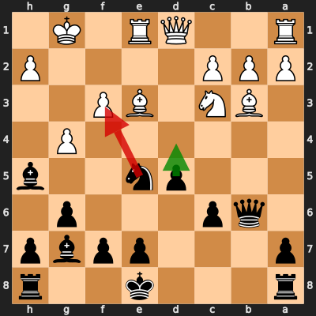
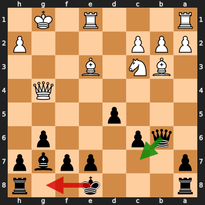

# Analysis: Mxlon vs erivera90

**Date:** 2026.04.06 | **Event:** Live Chess | **Site:** Chess.com

## Rolling CLAMP (last 20 games)
_Window: **20** game(s) on file, **33** blunder(s). Tags recorded on **30** blunder(s). (One blunder can have multiple CLAMP tags.)_

| Letter | Category | Count | Share of tag hits |
|--------|----------|-------|-------------------|
| **C** | Checks | 11 | 21% |
| **L** | Loose pieces / squares | 8 | 15% |
| **A** | Alignments (forks, pins, lines) | 20 | 38% |
| **M** | Mobility / trapped piece | 0 | 0% |
| **P** | Passed pawns | 14 | 26% |

Found **2** crucial moments.

## Moment 1 — Blunder [MINOR]

**Tactic:** Hanging Piece

- **CLAMP:** L
  - **L** (Loose pieces / squares): Material was loose, hanging, or lost in an unfavorable exchange.

**FEN:** `r3k2r/p3ppbp/1qp3p1/3pn2b/6P1/1BN1BP2/PPP4P/R2QR1K1 b kq - 2 14`

- **You Played:** **Nxf3+** (Red Arrow)
- **Engine Best:** **d4** (Green Arrow)
- **Eval Swing:** -211 cp
- **Variation:** _d4 Na4 Qb5 Bf4 Bxg4 fxg4_

> **CRITICAL: Your move allowed the opponent to immediately capture your Black Knight on f3.**

**Refutation:** _Qxf3 Bxg4 Qxg4 Qc7 Rad1 O-O_

---
## Moment 2 — Blunder [MINOR]

**Tactic:** Losing Exchange

- **CLAMP:** L
  - **L** (Loose pieces / squares): Material was loose, hanging, or lost in an unfavorable exchange.

**FEN:** `r3k2r/p3ppbp/1qp3p1/3p4/6Q1/1BN1B3/PPP4P/R3R1K1 b kq - 0 16`

- **You Played:** **O-O** (Red Arrow)
- **Engine Best:** **Qc7** (Green Arrow)
- **Eval Swing:** -203 cp
- **Variation:** _Qc7 Kh1 e6 Bf4 Qb7 Na4_

> **CRITICAL: Your move allowed the opponent to immediately capture your Black Queen on b6.**

**Refutation:** _Bxb6 axb6 Rad1 f5 Qf3 Kh8_

---
