# Analysis: erivera90 vs KaykeS1

**Date:** 2026.04.06 | **Event:** Live Chess | **Site:** Chess.com

## Rolling CLAMP (last 20 games)
_Window: **20** game(s) on file, **36** blunder(s). Tags recorded on **33** blunder(s). (One blunder can have multiple CLAMP tags.)_

| Letter | Category | Count | Share of tag hits |
|--------|----------|-------|-------------------|
| **C** | Checks | 12 | 21% |
| **L** | Loose pieces / squares | 11 | 19% |
| **A** | Alignments (forks, pins, lines) | 20 | 35% |
| **M** | Mobility / trapped piece | 0 | 0% |
| **P** | Passed pawns | 14 | 25% |

Found **12** crucial moments (10 blunders, 2 missed opportunitys).

## Moment 1 — Missed Opportunity [MINOR]

**Tactic:** Missed Hanging Piece

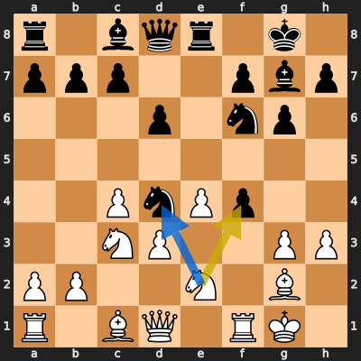

**FEN:** `r1bqr1k1/ppp2pbp/3p1np1/8/2PnPp2/2NP2PP/PP2N1B1/R1BQ1RK1 w - - 0 11`

- **You Played:** **Nxf4**
- **You Could Have Played:** **Nxd4**
- **Eval Swing:** -246 cp
- **Best Line:** _Nxd4 Nh5 Nce2 fxg3 Nf3 a5_

---
## Moment 2 — Blunder [CRITICAL]

**Tactic:** Hanging Pawn

- **CLAMP:** L
  - **L** (Loose pieces / squares): Material was loose, hanging, or lost in an unfavorable exchange.

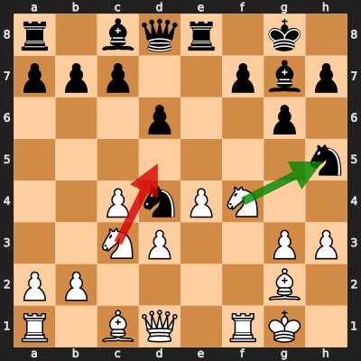

**FEN:** `r1bqr1k1/ppp2pbp/3p2p1/7n/2PnPN2/2NP2PP/PP4B1/R1BQ1RK1 w - - 1 12`

- **You Played:** **Ncd5** (Red Arrow)
- **Engine Best:** **Nxh5** (Green Arrow)
- **Eval Swing:** -508 cp
- **Variation:** _Nxh5 gxh5 Qxh5 Be6 Bg5 f6_

> **CRITICAL: Your move allowed the opponent to immediately capture your White Pawn on g3.**

**Refutation:** _Nxg3 Rf2 Be5 Be3 c6 Nc3_

---
## Moment 3 — Blunder [MAJOR]

**Tactic:** Losing Exchange

- **CLAMP:** L · P
  - **L** (Loose pieces / squares): Material was loose, hanging, or lost in an unfavorable exchange.
  - **P** (Passed pawns): Opponent's play creates or exploits a dangerous passed pawn.

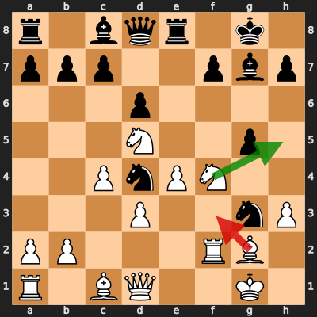

**FEN:** `r1bqr1k1/ppp2pbp/3p4/3N2p1/2PnPN2/3P2nP/PP3RB1/R1BQ2K1 w - - 0 14`

- **You Played:** **Bf3** (Red Arrow)
- **Engine Best:** **Nh5** (Green Arrow)
- **Eval Swing:** -331 cp
- **Variation:** _Nh5 Nde2+_

> **CRITICAL: Your move allowed the opponent to immediately capture your White Knight on f4.**

**Refutation:** _gxf4 Bxf4 c6 Bh5 Rf8 Bxg3_

---
## Moment 4 — Blunder [CRITICAL]

**Tactic:** Positional

- **CLAMP:** P
  - **P** (Passed pawns): Opponent's play creates or exploits a dangerous passed pawn.

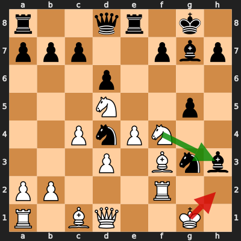

**FEN:** `r2qr1k1/ppp2pbp/3p4/3N2p1/2PnPN2/3P1Bnb/PP3R2/R1BQ2K1 w - - 0 15`

- **You Played:** **Kh2** (Red Arrow)
- **Engine Best:** **Nxh3** (Green Arrow)
- **Eval Swing:** -546 cp
- **Variation:** _Nxh3 f6 Be3 c6 Bxd4 cxd5_

**Refutation:** _Bd7 Kxg3 c6 Bh5 Be5 Kg2_

---
## Moment 5 — Blunder [MAJOR]

**Tactic:** Pin

- **CLAMP:** A · P
  - **A** (Alignments (forks, pins, lines)): Tactical alignment: fork, pin, skewer, discovered attack, or mating line.
  - **P** (Passed pawns): Opponent's play creates or exploits a dangerous passed pawn.

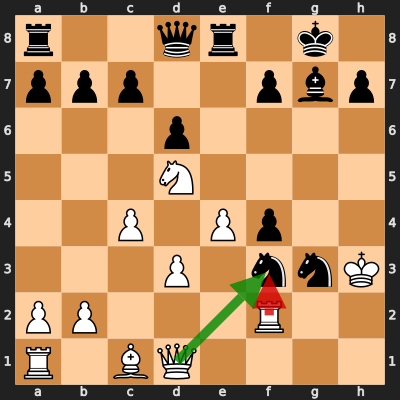

**FEN:** `r2qr1k1/ppp2pbp/3p4/3N4/2P1Pp2/3P1nnK/PP3R2/R1BQ4 w - - 0 17`

- **You Played:** **Rxf3** (Red Arrow)
- **Engine Best:** **Qxf3** (Green Arrow)
- **Eval Swing:** -309 cp
- **Variation:** _Qxf3_

**Refutation:** _Nh5 Rf1 Re5 Rg1 Rg5 Rxg5_

---
## Moment 6 — Blunder [MINOR]

**Tactic:** Pin

- **CLAMP:** A · P
  - **A** (Alignments (forks, pins, lines)): Tactical alignment: fork, pin, skewer, discovered attack, or mating line.
  - **P** (Passed pawns): Opponent's play creates or exploits a dangerous passed pawn.

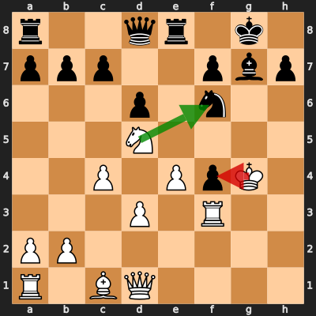

**FEN:** `r2qr1k1/ppp2pbp/3p1n2/3N4/2P1PpK1/3P1R2/PP6/R1BQ4 w - - 3 19`

- **You Played:** **Kxf4** (Red Arrow)
- **Engine Best:** **Nxf6+** (Green Arrow)
- **Eval Swing:** -228 cp
- **Variation:** _Nxf6+_

> **CRITICAL: Your move allowed the opponent to immediately capture your White Pawn on e4.**

**Refutation:** _Nxe4 Rh3 Qg5+ Kf3 Qf5+ Kg2_

---
## Moment 7 — Missed Opportunity [CRITICAL]

**Tactic:** Missed Forced Mate

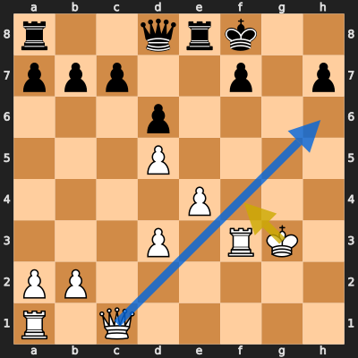

**FEN:** `r2qrk2/ppp2p1p/3p4/3P4/4P3/3P1RK1/PP6/R1Q5 w - - 1 23`

- **You Played:** **Kf4**
- **You Could Have Played:** **Qh6+**
- **Eval Swing:** -10028 cp
- **Best Line:** _Qh6+ Ke7 Rxf7+ Kxf7 Qxh7+ Kf6_

---
## Moment 8 — Blunder [CRITICAL]

**Tactic:** Pin

- **CLAMP:** C · A · P
  - **C** (Checks): Opponent's best line includes a damaging check or forced mate.
  - **A** (Alignments (forks, pins, lines)): Tactical alignment: fork, pin, skewer, discovered attack, or mating line.
  - **P** (Passed pawns): Opponent's play creates or exploits a dangerous passed pawn.

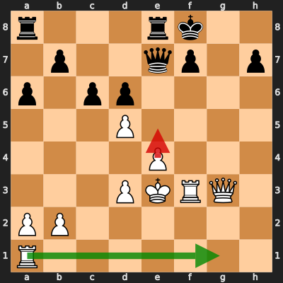

**FEN:** `r3rk2/1p2qp1p/p1pp4/3P4/4P3/3PKRQ1/PP6/R7 w - - 0 27`

- **You Played:** **e5** (Red Arrow)
- **Engine Best:** **Rg1** (Green Arrow)
- **Eval Swing:** -927 cp
- **Variation:** _Rg1 Qe5 Qg8+ Ke7 Qxf7+ Kd8_

> **CRITICAL: Your move allowed the opponent to immediately capture your White Pawn on e5.**

**Refutation:** _Qxe5+_

---
## Moment 9 — Blunder [MINOR]

**Tactic:** Hanging Pawn

- **CLAMP:** C · L · P
  - **C** (Checks): Opponent's best line includes a damaging check or forced mate.
  - **L** (Loose pieces / squares): Material was loose, hanging, or lost in an unfavorable exchange.
  - **P** (Passed pawns): Opponent's play creates or exploits a dangerous passed pawn.

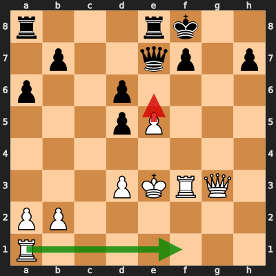

**FEN:** `r3rk2/1p2qp1p/p2p4/3pP3/8/3PKRQ1/PP6/R7 w - - 0 28`

- **You Played:** **e6** (Red Arrow)
- **Engine Best:** **Raf1** (Green Arrow)
- **Eval Swing:** -244 cp
- **Variation:** _Raf1 Qxe5+ Qxe5 Rxe5+ Kd4 Re7_

> **CRITICAL: Your move allowed the opponent to immediately capture your White Pawn on e6.**

**Refutation:** _Qxe6+ Kd4 Qe2 Qxd6+ Re7 Raf1_

---
## Moment 10 — Blunder [CRITICAL]

**Tactic:** Forced Mate

- **CLAMP:** C · A · P
  - **C** (Checks): Opponent's best line includes a damaging check or forced mate.
  - **A** (Alignments (forks, pins, lines)): Tactical alignment: fork, pin, skewer, discovered attack, or mating line.
  - **P** (Passed pawns): Opponent's play creates or exploits a dangerous passed pawn.

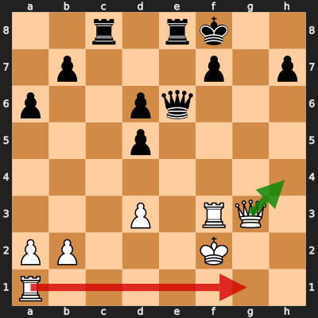

**FEN:** `2r1rk2/1p3p1p/p2pq3/3p4/8/3P1RQ1/PP3K2/R7 w - - 2 30`

- **You Played:** **Rg1** (Red Arrow)
- **Engine Best:** **Qh4** (Green Arrow)
- **Eval Swing:** -9701 cp
- **Variation:** _Qh4 Re7 Kg1 Rc2 Raf1 Ke8_

**Refutation:** _Qe2#_

---
## Moment 11 — Blunder [CRITICAL]

**Tactic:** Discovered Attack

- **CLAMP:** A · P
  - **A** (Alignments (forks, pins, lines)): Tactical alignment: fork, pin, skewer, discovered attack, or mating line.
  - **P** (Passed pawns): Opponent's play creates or exploits a dangerous passed pawn.

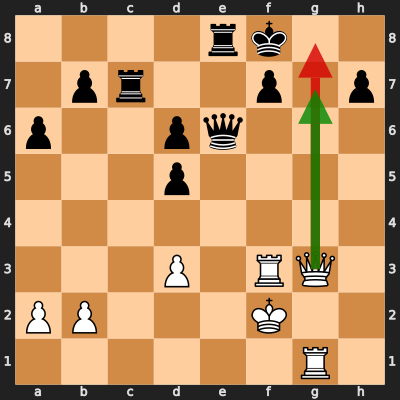

**FEN:** `4rk2/1pr2p1p/p2pq3/3p4/8/3P1RQ1/PP3K2/6R1 w - - 4 31`

- **You Played:** **Qg8+** (Red Arrow)
- **Engine Best:** **Qg7+** (Green Arrow)
- **Eval Swing:** -771 cp
- **Variation:** _Qg7+ Ke7 Re1 Kd8 Rxe6 fxe6_

**Refutation:** _Ke7 Qg5+ Kd7 Kg3 Kc8 Rgf1_

---
## Moment 12 — Blunder [CRITICAL]

**Tactic:** Forced Mate

- **CLAMP:** C · A · P
  - **C** (Checks): Opponent's best line includes a damaging check or forced mate.
  - **A** (Alignments (forks, pins, lines)): Tactical alignment: fork, pin, skewer, discovered attack, or mating line.
  - **P** (Passed pawns): Opponent's play creates or exploits a dangerous passed pawn.

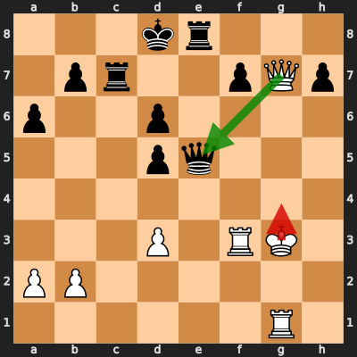

**FEN:** `3kr3/1pr2pQp/p2p4/3pq3/8/3P1RK1/PP6/6R1 w - - 10 34`

- **You Played:** **Kg4** (Red Arrow)
- **Engine Best:** **Qxe5** (Green Arrow)
- **Eval Swing:** -9621 cp
- **Variation:** _Qxe5 dxe5 Rh1 Rg8+ Kf2 Ke7_

> **CRITICAL: Your move allowed the opponent to immediately capture your White Queen on g7.**

**Refutation:** _Qxg7+ Kh5 Qxg1 Rf6 Rg8 Rxd6+_

---
