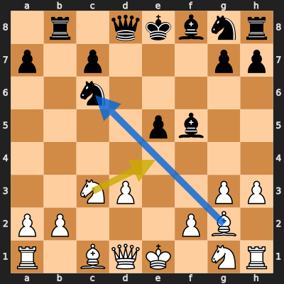
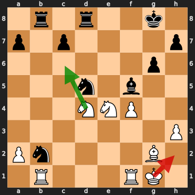
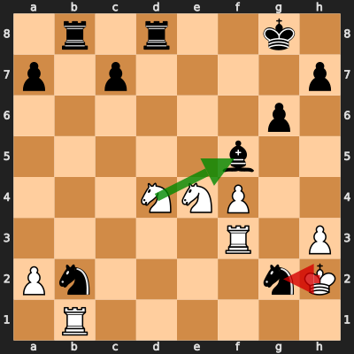

# Analysis: erivera90 vs notluckk

**Date:** 2026.04.06 | **Event:** Live Chess | **Site:** Chess.com

## Rolling CLAMP (last 20 games)
_Window: **20** game(s) on file, **35** blunder(s). Tags recorded on **32** blunder(s). (One blunder can have multiple CLAMP tags.)_

| Letter | Category | Count | Share of tag hits |
|--------|----------|-------|-------------------|
| **C** | Checks | 12 | 22% |
| **L** | Loose pieces / squares | 11 | 20% |
| **A** | Alignments (forks, pins, lines) | 19 | 35% |
| **M** | Mobility / trapped piece | 0 | 0% |
| **P** | Passed pawns | 13 | 24% |

Found **3** crucial moments (2 blunders, 1 missed opportunity).

## Moment 1 — Missed Opportunity [CRITICAL]

**Tactic:** Missed Hanging Piece

**FEN:** `1r1qkbnr/p1p3pp/2n5/4pb2/8/2NP2PP/PP3PB1/R1BQK1NR w KQk - 3 12`

- **You Played:** **Ne4**
- **You Could Have Played:** **Bxc6+**
- **Eval Swing:** -645 cp
- **Best Line:** _Bxc6+ Kf7 Nf3 Ne7 Ng5+ Kg8_

---
## Moment 2 — Blunder [CRITICAL]

**Tactic:** Fork

- **CLAMP:** A · P
  - **A** (Alignments (forks, pins, lines)): Tactical alignment: fork, pin, skewer, discovered attack, or mating line.
  - **P** (Passed pawns): Opponent's play creates or exploits a dangerous passed pawn.

**FEN:** `1r1r2k1/p1p4p/6p1/3n1b2/3NNP2/7P/Pn4B1/1R3RK1 w - - 0 22`

- **You Played:** **Kh2** (Red Arrow)
- **Engine Best:** **Nc6** (Green Arrow)
- **Eval Swing:** -554 cp
- **Variation:** _Nc6 Ne3 Nxd8 Rxd8 Rxb2 Nxg2_

**Refutation:** _Ne3 Nxf5 Nxf1+ Rxf1 gxf5 Nf6+_

---
## Moment 3 — Blunder [MAJOR]

**Tactic:** Pin

- **CLAMP:** A · P
  - **A** (Alignments (forks, pins, lines)): Tactical alignment: fork, pin, skewer, discovered attack, or mating line.
  - **P** (Passed pawns): Opponent's play creates or exploits a dangerous passed pawn.

**FEN:** `1r1r2k1/p1p4p/6p1/5b2/3NNP2/5R1P/Pn4nK/1R6 w - - 0 24`

- **You Played:** **Kxg2** (Red Arrow)
- **Engine Best:** **Nxf5** (Green Arrow)
- **Eval Swing:** -488 cp
- **Variation:** _Nxf5_

> **CRITICAL: Your move allowed the opponent to immediately capture your White Knight on e4.**

**Refutation:** _Bxe4 Rc1 Rxd4 Rxc7 Rd3 Kg1_

---
