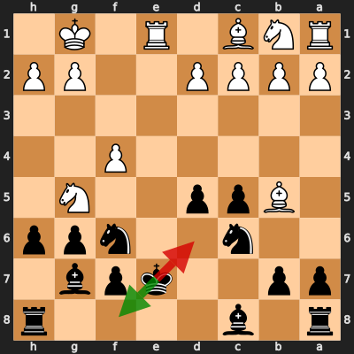
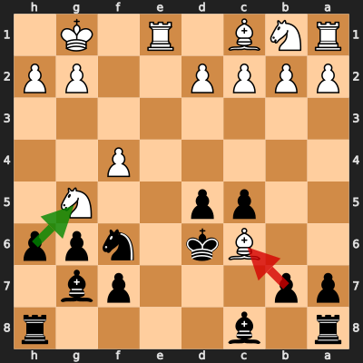

# Analysis: johnnes-b vs erivera90

**Date:** 2026.04.06 | **Event:** Live Chess | **Site:** Chess.com

## Rolling CLAMP (last 20 games)
_Window: **20** game(s) on file, **34** blunder(s). Tags recorded on **31** blunder(s). (One blunder can have multiple CLAMP tags.)_

| Letter | Category | Count | Share of tag hits |
|--------|----------|-------|-------------------|
| **C** | Checks | 10 | 19% |
| **L** | Loose pieces / squares | 10 | 19% |
| **A** | Alignments (forks, pins, lines) | 19 | 37% |
| **M** | Mobility / trapped piece | 0 | 0% |
| **P** | Passed pawns | 13 | 25% |

Found **2** crucial moments.

## Moment 1 — Blunder [MAJOR]

**Tactic:** Hanging Pawn

- **CLAMP:** C · L
  - **C** (Checks): Opponent's best line includes a damaging check or forced mate.
  - **L** (Loose pieces / squares): Material was loose, hanging, or lost in an unfavorable exchange.

**FEN:** `r1b4r/pp2kpb1/2n2npp/1Bpp2N1/5P2/8/PPPP2PP/RNB1R1K1 b - - 1 12`

- **You Played:** **Kd6** (Red Arrow)
- **Engine Best:** **Kf8** (Green Arrow)
- **Eval Swing:** -301 cp
- **Variation:** _Kf8 Nf3_

> **CRITICAL: Your move allowed the opponent to immediately capture your Black Pawn on f7.**

**Refutation:** _Nxf7+ Kc7 Nxh8 Bxh8 Bxc6 Kxc6_

---
## Moment 2 — Blunder [CRITICAL]

**Tactic:** Hanging Pawn

- **CLAMP:** C · L
  - **C** (Checks): Opponent's best line includes a damaging check or forced mate.
  - **L** (Loose pieces / squares): Material was loose, hanging, or lost in an unfavorable exchange.

**FEN:** `r1b4r/pp3pb1/2Bk1npp/2pp2N1/5P2/8/PPPP2PP/RNB1R1K1 b - - 0 13`

- **You Played:** **bxc6** (Red Arrow)
- **Engine Best:** **hxg5** (Green Arrow)
- **Eval Swing:** -505 cp
- **Variation:** _hxg5 Ba4 Bd7 Bxd7 Kxd7 fxg5_

> **CRITICAL: Your move allowed the opponent to immediately capture your Black Pawn on f7.**

**Refutation:** _Nxf7+ Kc7 Nxh8 Bxh8 d3 Bf5_

---
